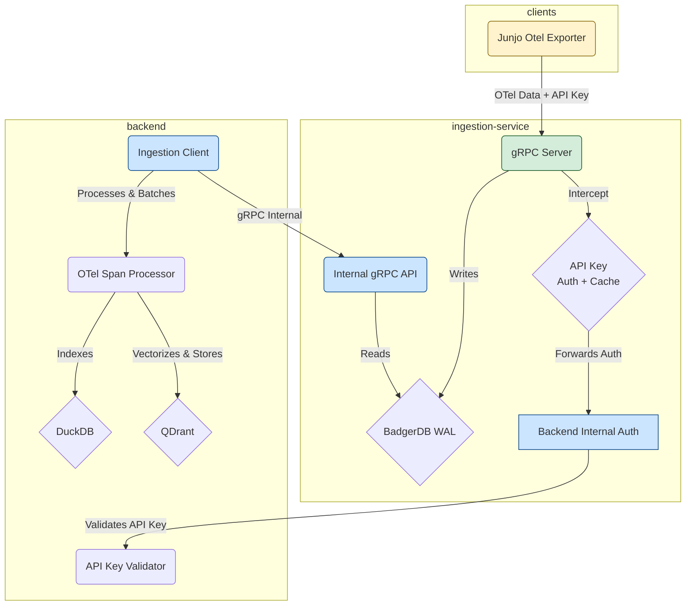
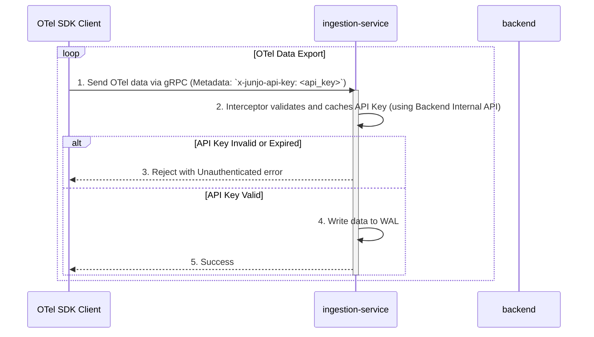

# Junjo Server: System Architecture for LLM Agents

This document provides a high-level overview of the Junjo Server architecture, designed to help LLM agents quickly understand the system's components and interaction flows.

## 1. System Overview

The Junjo Server is a multi-service system designed for ingesting, storing, and analyzing OpenTelemetry (OTel) data. It consists of two primary backend services and client-side telemetry collection via the Junjo Otel Exporter.

*   **`backend`**: The main application server. It handles user authentication, provides the API and web UI, and processes telemetry data for analysis.
*   **`ingestion-service`**: A dedicated, high-throughput service responsible for receiving OTel data from clients and persisting it to a Write-Ahead Log (WAL).
*   **Junjo Otel Exporter**: A specialized OpenTelemetry exporter that sends telemetry data to the ingestion-service.

## 2. Component Architecture

The services are designed to be decoupled, with specific responsibilities to ensure scalability and resilience.

### `backend` Service

*   **Responsibilities**:
    *   Serves the main web UI and REST API on port `1323`.
    *   Manages user accounts and API keys.
    *   Provides an internal gRPC endpoint for validating API keys.
    *   Reads data from the `ingestion-service` to index it into a queryable database (DuckDB) and vector store (QDrant).
*   **Internal Authentication Endpoint**:
    *   `J[Backend Internal Auth]`: Private gRPC endpoint for validating API keys.
*   **Key Files**:
    *   [`backend/main.go`](backend/main.go): Main application entry point.
    *   [`backend/api/internal_auth/grpc_api_key_auth.go`](backend/api/internal_auth/grpc_api_key_auth.go): Internal gRPC API key validation service.

### `ingestion-service`

*   **Responsibilities**:
    *   Exposes a public gRPC server on port `50051` that serves as the single point of contact for clients.
    *   **Enforces Authentication**: Protects its OTel endpoints using an API key interceptor that validates and caches keys using the backend's internal auth endpoint.
    *   Persists all incoming data to a highly-performant Write-Ahead Log (WAL) using BadgerDB.
*   **Key Files**:
    *   [`ingestion-service/main.go`](ingestion-service/main.go): Main application entry point.
    *   [`ingestion-service/server/server.go`](ingestion-service/server/server.go): gRPC server setup.
    *   [`ingestion-service/server/api_key_interceptor.go`](ingestion-service/server/api_key_interceptor.go): The API key authentication and caching logic.
    *   [`ingestion-service/backend_client/auth_client.go`](ingestion-service/backend_client/auth_client.go): The client for the backend's internal API key validation service.

## 3. Authentication Flow (API Key-based)

Authentication is handled via direct API key validation with caching, facilitated by the `ingestion-service` to provide secure and efficient access to the OTel ingestion endpoint.

### Step-by-Step Process:

1.  **Direct API Key Transfer**: The client sends its API key in the metadata header `x-junjo-api-key` along with OTel data directly to the ingestion service's gRPC server.
2.  **Interceptor Processing**: The ingestion service's API key interceptor intercepts the request and first checks its local cache for the API key.
3.  **Cache Check**: If the API key is found in the cache and is not expired, the request proceeds to be written to the WAL.
4.  **Backend Validation**: If the API key is not in the cache or is expired, the ingestion service forwards the API key to the backend's internal authentication gRPC service for validation.
5.  **Validation Response**: The backend checks the API key against its database and returns the validation result.
6.  **Cache Update**: The ingestion service updates its cache with the validation result, including an expiration time.
7.  **Access Control**: If the API key is valid (either from cache or backend), the request is allowed to proceed and the OTel data is written to the WAL. Otherwise, it is rejected with an `Unauthenticated` error.

## 4. Data Flow: WAL and Indexing

The `ingestion-service` acts as a Write-Ahead Log (WAL) for the main `backend`. This decouples the high-throughput ingestion of OTel data from the more resource-intensive process of indexing that data for querying.

### Step-by-Step Process:

1.  **Write to WAL**: The `ingestion-service` receives OTel data via its public gRPC endpoint and immediately writes the raw, serialized data to a BadgerDB WAL. This is a fast, append-only operation.

2.  **Internal Read API**: The `ingestion-service` exposes a second, internal-only gRPC service (`WALReaderService`) that allows the `backend` to read data from the WAL in batches.

3.  **Client Polling**: The `backend`'s `ingestion_client` periodically polls the `WALReaderService`, requesting a batch of spans starting from the last key it successfully processed.

4.  **State Management**: The `backend` is responsible for persisting the key of the last span it indexed. This ensures that if the `backend` restarts, it can resume processing from where it left off without missing any data.

5.  **Processing and Indexing**: Once the `backend` receives a batch of spans, it uses its `otel_span_processor` to deserialize, process, and index the data into a DuckDB database and vector store (QDrant), making it available for querying via the main API.

This pull-based architecture makes the system resilient. The `ingestion-service` can continue to accept data even if the `backend` is temporarily down or slow to index.