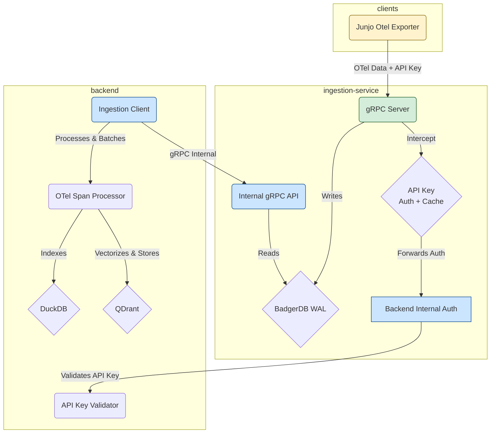
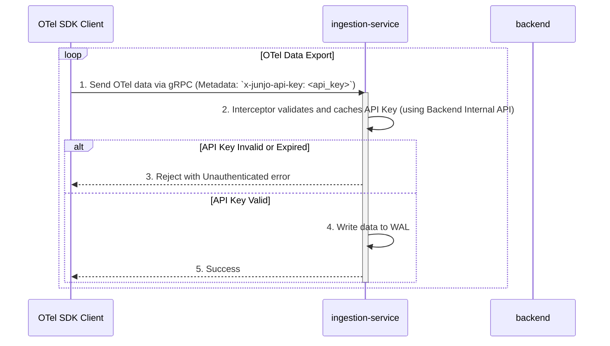
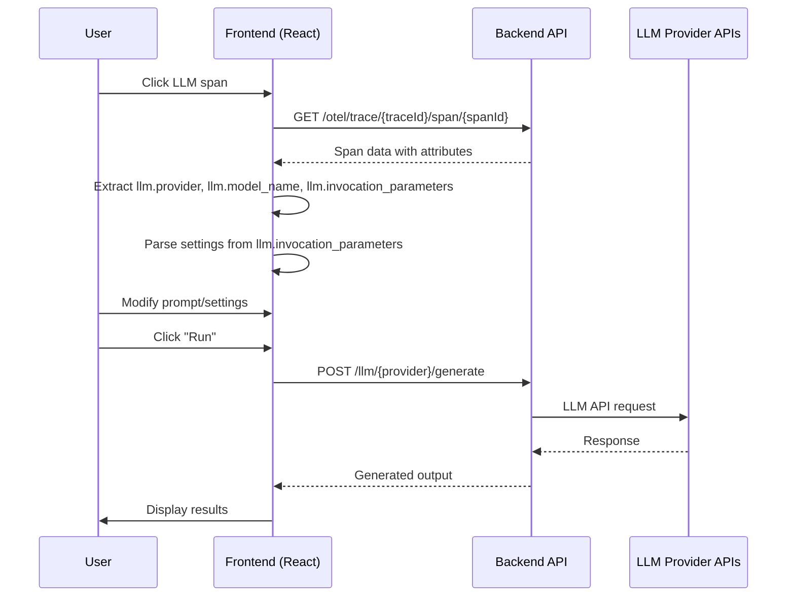

# Junjo Server: System Architecture for LLM Agents

This document provides a high-level overview of the Junjo Server architecture, designed to help LLM agents quickly understand the system's components and interaction flows.

## 1. System Overview

The Junjo Server is a multi-service system designed for ingesting, storing, and analyzing OpenTelemetry (OTel) data. It consists of two primary backend services and client-side telemetry collection via the Junjo Otel Exporter.

*   **`backend`**: The main application server. It handles user authentication, provides the API and web UI, and processes telemetry data for analysis.
*   **`ingestion-service`**: A dedicated, high-throughput service responsible for receiving OTel data from clients and persisting it to a Write-Ahead Log (WAL).
*   **Junjo Otel Exporter**: A specialized OpenTelemetry exporter that sends telemetry data to the ingestion-service.

## 2. Component Architecture

The services are designed to be decoupled, with specific responsibilities to ensure scalability and resilience.



### `backend` Service

*   **Responsibilities**:
    *   Serves the main web UI and REST API on port `1323`.
    *   Manages user accounts and API keys.
    *   Provides an internal gRPC endpoint for validating API keys.
    *   Reads data from the `ingestion-service` to index it into a queryable database (DuckDB) and vector store (QDrant).
*   **Internal Authentication Endpoint**:
    *   `J[Backend Internal Auth]`: Private gRPC endpoint for validating API keys.
*   **Key Files**:
    *   [`backend/main.go`](backend/main.go): Main application entry point.
    *   [`backend/api/internal_auth/grpc_api_key_auth.go`](backend/api/internal_auth/grpc_api_key_auth.go): Internal gRPC API key validation service.

### `ingestion-service`

*   **Responsibilities**:
    *   Exposes a public gRPC server on port `50051` that serves as the single point of contact for clients.
    *   **Enforces Authentication**: Protects its OTel endpoints using an API key interceptor that validates and caches keys using the backend's internal auth endpoint.
    *   Persists all incoming data to a highly-performant Write-Ahead Log (WAL) using BadgerDB.
*   **Key Files**:
    *   [`ingestion-service/main.go`](ingestion-service/main.go): Main application entry point.
    *   [`ingestion-service/server/server.go`](ingestion-service/server/server.go): gRPC server setup.
    *   [`ingestion-service/server/api_key_interceptor.go`](ingestion-service/server/api_key_interceptor.go): The API key authentication and caching logic.
    *   [`ingestion-service/backend_client/auth_client.go`](ingestion-service/backend_client/auth_client.go): The client for the backend's internal API key validation service.

## 3. Authentication Flow (API Key-based)

Authentication is handled via direct API key validation with caching, facilitated by the `ingestion-service` to provide secure and efficient access to the OTel ingestion endpoint.



### Step-by-Step Process:

1.  **Direct API Key Transfer**: The client sends its API key in the metadata header `x-junjo-api-key` along with OTel data directly to the ingestion service's gRPC server.
2.  **Interceptor Processing**: The ingestion service's API key interceptor intercepts the request and first checks its local cache for the API key.
3.  **Cache Check**: If the API key is found in the cache and is not expired, the request proceeds to be written to the WAL.
4.  **Backend Validation**: If the API key is not in the cache or is expired, the ingestion service forwards the API key to the backend's internal authentication gRPC service for validation.
5.  **Validation Response**: The backend checks the API key against its database and returns the validation result.
6.  **Cache Update**: The ingestion service updates its cache with the validation result, including an expiration time.
7.  **Access Control**: If the API key is valid (either from cache or backend), the request is allowed to proceed and the OTel data is written to the WAL. Otherwise, it is rejected with an `Unauthenticated` error.

## 4. Data Flow: WAL and Indexing

The `ingestion-service` acts as a Write-Ahead Log (WAL) for the main `backend`. This decouples the high-throughput ingestion of OTel data from the more resource-intensive process of indexing that data for querying.

### Step-by-Step Process:

1.  **Write to WAL**: The `ingestion-service` receives OTel data via its public gRPC endpoint and immediately writes the raw, serialized data to a BadgerDB WAL. This is a fast, append-only operation.

2.  **Internal Read API**: The `ingestion-service` exposes a second, internal-only gRPC service (`WALReaderService`) that allows the `backend` to read data from the WAL in batches.

3.  **Client Polling**: The `backend`'s `ingestion_client` periodically polls the `WALReaderService`, requesting a batch of spans starting from the last key it successfully processed.

4.  **State Management**: The `backend` is responsible for persisting the key of the last span it indexed. This ensures that if the `backend` restarts, it can resume processing from where it left off without missing any data.

5.  **Processing and Indexing**: Once the `backend` receives a batch of spans, it uses its `otel_span_processor` to deserialize, process, and index the data into a DuckDB database and vector store (QDrant), making it available for querying via the main API.

This pull-based architecture makes the system resilient. The `ingestion-service` can continue to accept data even if the `backend` is temporarily down or slow to index.

## 5. OpenInference Semantic Conventions

Junjo Server uses **OpenInference** semantic conventions for LLM observability. OpenInference is a standardized format for capturing LLM-related telemetry data within OpenTelemetry spans.

### Key OpenInference Attributes

The system expects and utilizes the following OpenInference attributes on LLM spans:

*   **`llm.provider`**: The LLM provider (e.g., `"openai"`, `"anthropic"`, `"google"`)
    *   **Note**: OpenInference uses `"google"` for Gemini, but internally Junjo maps this to `"gemini"`
*   **`llm.model_name`**: The specific model identifier (e.g., `"gpt-4o"`, `"claude-3-5-sonnet-20241022"`, `"gemini-2.0-flash-exp"`)
*   **`llm.invocation_parameters`**: A JSON string containing all request parameters used during the LLM invocation
    *   Example: `'{"temperature": 0.7, "max_tokens": 2048, "reasoning_effort": "medium"}'`
    *   This is the **primary source** for generation settings in the Prompt Playground
*   **`input.mime_type`**: The MIME type of the input (e.g., `"application/json"` indicates structured output was used)
*   **`output.mime_type`**: The MIME type of the output
*   **`input.value`**: The actual prompt text sent to the LLM
*   **`output.value`**: The generated response from the LLM

### Provider Mapping

The system includes utilities for mapping between OpenInference provider names and internal representations:

*   **Frontend**: `frontend/src/features/prompt-playground/utils/provider-mapping.ts`
*   **Backend**: `backend/api/llm/provider/provider_mapping.go`

Current mappings:
*   `"google"` (OpenInference) → `"gemini"` (Junjo internal)
*   `"openai"` → `"openai"` (no mapping needed)
*   `"anthropic"` → `"anthropic"` (no mapping needed)

## 6. Prompt Playground Architecture

The Prompt Playground is a feature that allows users to replay, modify, and experiment with LLM requests captured from their applications.

### Core Concept

When a user clicks on an LLM span in the trace viewer, they can open the Prompt Playground to:
1. See the original prompt and model configuration
2. Modify the prompt and settings
3. Re-run the request against the same or different models/providers
4. Compare outputs

### Data Flow



### Provider-Specific Endpoints

The backend provides separate REST endpoints for each LLM provider:

*   **OpenAI**: `POST /llm/openai/generate`
    *   Handler: `backend/api/llm/openai/handler.go`
    *   Schema: `backend/api/llm/openai/schemas.go`
*   **Anthropic**: `POST /llm/anthropic/generate`
    *   Handler: `backend/api/llm/anthropic/handler.go`
    *   Schema: `backend/api/llm/anthropic/schemas.go`
*   **Gemini**: `POST /llm/gemini/generate`
    *   Handler: `backend/api/llm/gemini/handler.go`
    *   Schema: `backend/api/llm/gemini/schemas.go`

Each handler:
1. Validates the request using Go structs
2. Retrieves the API key from environment variables
3. Forwards the request to the provider's API
4. Returns the response (or error) to the frontend

### Frontend Architecture

**Main Component**: `frontend/src/features/prompt-playground/PromptPlaygroundPage.tsx`

**Key State Management**:
*   Uses Redux Toolkit for state: `frontend/src/features/prompt-playground/store/slice.ts`
*   State includes:
    *   `selectedModel`: Currently selected model
    *   `selectedProvider`: Currently selected provider
    *   `jsonMode`: Whether the Structured Output toggle is enabled (internal variable name)
    *   `generationSettings`: Provider-specific generation parameters

**Request Schemas**: `frontend/src/features/prompt-playground/schemas/`
*   `openai-request.ts`: Zod schemas for OpenAI requests/responses
*   `anthropic-request.ts`: Zod schemas for Anthropic requests/responses
*   `gemini-request.ts`: Zod schemas for Gemini requests/responses

### Generation Settings

The Prompt Playground supports provider-specific and model-specific generation settings:

#### Settings Import from OpenInference

When a span is loaded, settings are imported from `llm.invocation_parameters`:

```typescript
// Example llm.invocation_parameters value:
{
  "temperature": 0.7,
  "max_completion_tokens": 4096,
  "reasoning_effort": "medium"  // OpenAI reasoning models only
}
```

The frontend parses this JSON and populates the settings UI.

#### Provider-Specific Settings

**OpenAI**:
*   `reasoning_effort`: `"minimal" | "low" | "medium" | "high"` (reasoning models only: o1, o3, o4, gpt-5, but NOT o1-mini)
*   `max_completion_tokens`: Number (all models)
*   `temperature`: Number 0-2 (non-reasoning models only)

**Anthropic**:
*   `thinking_enabled`: Boolean (enables extended thinking)
*   `thinking_budget_tokens`: Number ≥1024 (requires thinking_enabled)
*   `temperature`: Number 0-1
*   `max_tokens`: Number (required by API)

**Gemini**:
*   `thinkingBudget`: Number (-1 = dynamic, 0 = disabled, 1-32768 = specific budget)
    *   **Important**: This must be nested in `generationConfig.thinkingConfig.thinkingBudget`
    *   Only supported on Gemini 2.5 series models (2.5-pro, 2.5-flash, 2.5-flash-lite)
*   `includeThoughts`: Boolean (includes thought summaries in response)
    *   **Important**: This must be nested in `generationConfig.thinkingConfig.includeThoughts`
*   `temperature`: Number 0-2
*   `maxOutputTokens`: Number

Example Gemini request structure with thinking:
```json
{
  "model": "gemini-2.5-flash",
  "contents": [...],
  "generationConfig": {
    "temperature": 0.7,
    "maxOutputTokens": 2048,
    "thinkingConfig": {
      "thinkingBudget": 1024,
      "includeThoughts": true
    }
  }
}
```

### Structured Output Toggle

The Prompt Playground provides a **Structured Output** toggle that enables JSON output from LLM requests. When enabled, the application intelligently chooses the best approach based on telemetry data:

#### Toggle Behavior Logic

The Structured Output toggle controls whether JSON output is requested from the LLM. The specific implementation depends on whether a JSON schema was detected from the original request's OpenInference telemetry:

| Structured Output Toggle | Schema Detected from Telemetry? | Request Behavior |
|--------------------------|----------------------------------|------------------|
| ✅ **Enabled** | ✅ **Yes** | **Structured Outputs** (schema-based)<br/>Schema-constrained JSON that adheres to the detected schema |
| ✅ **Enabled** | ❌ **No** | **Schema-less JSON Mode**<br/>Unconstrained JSON output without schema validation |
| ❌ **Disabled** | ✅ Yes | **Normal text mode**<br/>Schema is ignored, even if detected |
| ❌ **Disabled** | ❌ No | **Normal text mode**<br/>Standard text response |

**Key Points**:
- When a schema is detected from telemetry and the toggle is enabled, the application uses **modern Structured Outputs** (the preferred approach)
- When no schema is available but JSON output is desired, the application falls back to **schema-less JSON mode** for experimentation
- The schema is **only sent** when the toggle is enabled AND a schema is detected
- Disabling the toggle always results in normal text mode, regardless of schema availability

#### Structured Outputs vs Schema-less JSON Mode

| Feature | Structured Outputs (with schema) | Schema-less JSON Mode |
|---------|----------------------------------|----------------------|
| Outputs valid JSON | ✅ Yes | ✅ Yes |
| Adheres to schema | ✅ Yes (guaranteed) | ❌ No (best effort) |
| Schema required | ✅ Yes (from telemetry) | ❌ No |
| **OpenAI Implementation** | `response_format: { type: "json_schema", json_schema: {...} }` | `response_format: { type: "json_object" }` |
| **Anthropic Implementation** | `tools: [{ input_schema: {...} }], tool_choice: {...}` | Generic tool with flexible schema |
| **Gemini Implementation** | `response_json_schema: {...}` | `responseMimeType: "application/json"` only |
| **When Used** | Schema detected from original request | No schema available, user wants JSON |
| **Reliability** | High (schema enforced) | Medium (LLM does its best) |

#### Detection from OpenInference Telemetry

**Detection Utilities**: `frontend/src/features/prompt-playground/utils/provider-warnings.ts`

All providers store JSON schemas in the `llm.invocation_parameters` attribute, but in different locations and formats:

**OpenAI Schema Detection**:
```typescript
// Location: llm.invocation_parameters.response_format.json_schema.schema
{
  "response_format": {
    "type": "json_schema",
    "json_schema": {
      "name": "person_schema",
      "strict": true,
      "schema": {  // ← Extracted schema
        "type": "object",
        "properties": {
          "name": { "type": "string" },
          "age": { "type": "number" }
        },
        "required": ["name", "age"]
      }
    }
  }
}
```

**Anthropic Schema Detection**:
```typescript
// Location: llm.invocation_parameters.tools[0].input_schema
{
  "tools": [
    {
      "name": "structured_output",
      "description": "Return data in structured JSON format",
      "input_schema": {  // ← Extracted schema
        "type": "object",
        "properties": {
          "summary": { "type": "string" },
          "topics": { "type": "array", "items": { "type": "string" } }
        },
        "required": ["summary"]
      }
    }
  ],
  "tool_choice": { "type": "tool", "name": "structured_output" }
}
```

**Gemini Schema Detection**:
```typescript
// Location: llm.invocation_parameters.response_json_schema
{
  "response_json_schema": {  // ← Extracted schema
    "type": "object",  // Note: JSON Schema format (lowercase) - same as OpenAI/Anthropic
    "properties": {
      "title": { "type": "string", "description": "The title of the article" },
      "content": { "type": "string", "description": "The main content" },
      "tags": { "type": "array", "items": { "type": "string" } },
      "published": { "type": "boolean" }
    },
    "required": ["title", "content"]
  }
}
```

**Unified Detection Function**:
```typescript
// Returns the schema if found, null otherwise
const jsonSchema = detectJsonSchema(span)  // Tries all provider detectors
```

**Important Notes:**
- **`response_json_schema`** (snake_case) is the proper telemetry attribute for modern Gemini structured outputs
- Uses JSON Schema format (lowercase types), fully compatible with OpenAI and Anthropic
- The genai Python library captures this when using the `response_schema` parameter with Pydantic models
- The legacy `responseSchema` (camelCase) used OpenAPI 3.0 format and is deprecated

#### Schema Forwarding to Provider APIs

When the Structured Output toggle is enabled, schemas are extracted **on-demand** in `PromptPlaygroundPage.tsx` during `handleSubmit()`:

```typescript
const handleSubmit = async (event: React.FormEvent<HTMLFormElement>) => {
  // Extract schema on-demand from span (no Redux state)
  const jsonSchema = span ? detectJsonSchema(span) : null

  // jsonMode variable tracks the Structured Output toggle state
  // Schema is only used if toggle is enabled (jsonMode === true)
}
```

**OpenAI**:
```typescript
await openaiRequest({
  model: selectedModel,
  messages: [{ role: 'user', content: prompt }],
  // Structured output with JSON schema (when schema detected)
  ...(jsonMode && jsonSchema && {
    response_format: {
      type: 'json_schema',
      json_schema: {
        name: 'structured_output',
        strict: true,
        schema: jsonSchema  // ← Forwarded schema
      }
    }
  }),
  // Schema-less JSON mode (when no schema detected)
  ...(jsonMode && !jsonSchema && {
    response_format: { type: 'json_object' }
  }),
})
```

**Anthropic**:
```typescript
await anthropicRequest({
  model: selectedModel,
  messages: [{ role: 'user', content: prompt }],
  max_tokens: generationSettings.max_tokens || 4096,
  // Structured output via tools with JSON schema (when schema detected)
  ...(jsonMode && jsonSchema && {
    tools: [{
      name: 'structured_output',
      description: 'Return data in structured JSON format',
      input_schema: jsonSchema  // ← Forwarded schema
    }],
    tool_choice: { type: 'tool', name: 'structured_output' }
  }),
  // Schema-less JSON mode (when no schema detected)
  ...(jsonMode && !jsonSchema && {
    jsonMode: true  // Backend handles generic tool setup
  }),
})
```

**Gemini**:
```typescript
await geminiRequest({
  model: selectedModel,
  contents: [{ parts: [{ text: prompt }] }],
  generationConfig: {
    // Structured output with JSON schema (when schema detected)
    ...(jsonMode && jsonSchema && {
      responseMimeType: 'application/json',
      response_json_schema: jsonSchema  // ← Forwarded schema
    }),
    // Schema-less JSON mode (when no schema detected)
    ...(jsonMode && !jsonSchema && {
      responseMimeType: 'application/json'
    }),
  }
})
```

#### Backend Schema Support

**OpenAI** (`backend/api/llm/openai/schemas.go`):
```go
type OpenAIJSONSchema struct {
    Name   string                 `json:"name"`
    Strict *bool                  `json:"strict,omitempty"`
    Schema map[string]interface{} `json:"schema"`
}

type OpenAIResponseFormat struct {
    Type       string            `json:"type"` // "json_schema" | "json_object" | "text"
    JSONSchema *OpenAIJSONSchema `json:"json_schema,omitempty"`
}
```

**Gemini** (`backend/api/llm/gemini/schemas.go`):
```go
type GeminiGenerationConfig struct {
    Temperature         *float64               `json:"temperature,omitempty"`
    ResponseMimeType    string                 `json:"responseMimeType,omitempty"`
    ResponseJSONSchema  map[string]interface{} `json:"response_json_schema,omitempty"`
    ThinkingConfig      *GeminiThinkingConfig  `json:"thinkingConfig,omitempty"`
}
```

**Anthropic** (`backend/api/llm/anthropic/schemas.go`):
```go
type AnthropicRequest struct {
    // ... other fields ...
    Tools      []AnthropicTool      `json:"tools,omitempty"`
    ToolChoice *AnthropicToolChoice `json:"tool_choice,omitempty"`

    // Schema-less JSON mode fallback (when no schema available)
    JSONMode bool `json:"jsonMode,omitempty"`
}
```

#### Schema Format Compatibility

**Good News**: All three providers now use JSON Schema format for structured outputs!

**Gemini Structured Output Approaches:**

1. **`response_json_schema`** (RECOMMENDED - Modern approach):
   - Uses JSON Schema format (lowercase: `"string"`, `"object"`, `"number"`)
   - Same format as OpenAI and Anthropic
   - Directly compatible across providers
   - Documentation: https://ai.google.dev/gemini-api/docs/structured-output#json-schemas

2. **`responseSchema`** (LEGACY - Deprecated):
   - Used OpenAPI 3.0 format (uppercase: `"STRING"`, `"OBJECT"`, `"NUMBER"`)
   - Incompatible with OpenAI/Anthropic schemas
   - Not recommended for new implementations

**Current Behavior**: Schemas detected from telemetry using `response_json_schema` are fully compatible across all three providers (OpenAI, Anthropic, Gemini) and can be forwarded as-is.

**Legacy Compatibility**: If old telemetry contains `responseSchema` with OpenAPI 3.0 format, schema conversion would be needed for cross-provider compatibility. However, new implementations should use `response_json_schema`.

#### UI Indicators

**Structured Output Toggle** (`frontend/src/features/prompt-playground/PromptPlaygroundPage.tsx`):
- Located in the playground controls area
- Label: "Structured Output"
- When enabled with schema detected: Uses schema-based structured outputs
- When enabled without schema: Uses schema-less JSON mode with warning message

**JsonSchemaBanner** (`frontend/src/features/prompt-playground/components/JsonSchemaBanner.tsx`):
- Displays when a schema is detected from telemetry
- Message: "JSON Schema detected and active - Playground requests will use this schema for structured output"
- Clickable to view full schema details in modal
- Only shows when schema is available (independent of toggle state)

**Schema-less Mode Warning**:
- Displays when Structured Output toggle is enabled but no schema is detected
- Message: "Note: No JSON schema detected from the original request. Using schema-less JSON mode. If the original request used a typed schema, results may differ."

**ActiveSettingsDisplay** (`frontend/src/features/prompt-playground/components/ActiveSettingsDisplay.tsx`):
- Shows `json_schema: active` indicator when both:
  - Structured Output toggle is enabled AND
  - A schema is detected from telemetry
- Displayed alongside other active generation settings

#### Testing

**Frontend Tests**: `frontend/src/features/prompt-playground/utils/provider-warnings.test.ts`
- Mock OpenInference spans with realistic schemas for all three providers
- Tests schema detection, edge cases, and robustness
- 18 tests covering all providers and error conditions

**Backend Tests**:
- `backend/api/llm/openai/handler_test.go`: Tests OpenAI schema marshaling and request structure
- `backend/api/llm/gemini/handler_test.go`: Tests Gemini schema marshaling and OpenAPI format

Run tests:
```bash
# Frontend
cd frontend && npm run test:run

# Backend
cd backend
go test ./api/llm/openai -v
go test ./api/llm/gemini -v
```

### Model Capability Detection

Different models support different parameters. The playground uses pattern matching to determine capabilities:

**OpenAI Reasoning Models**: `/^(o1-(?!mini)|o3-|o4-|gpt-5)/`
*   Supports: `reasoning_effort`, `max_completion_tokens`
*   Does NOT support: `temperature`
*   Note: `o1-mini` is excluded as it doesn't support `reasoning_effort`

**Gemini Thinking Models**: `/^gemini-2\.5-/`
*   Only 2.5 series supports thinking
*   2.0, 1.5, and earlier do NOT support thinking

**Anthropic Extended Thinking Models**: Claude Sonnet 4.x/3.7, Haiku 4.x, Opus 4.x
*   Older models like `claude-3-5-sonnet` do NOT support extended thinking

### Settings Reset Behavior

**Critical Implementation Detail**: The playground follows a "reset on change" pattern:

1. When the user changes the selected model or provider, ALL settings are reset to `{}`
2. Settings are then re-imported from `llm.invocation_parameters` if available
3. No attempt is made to preserve or migrate settings between model selections

This is implemented in `PromptPlaygroundPage.tsx` using a `useEffect` that watches `selectedModel` and `selectedProvider`.

### UI Components

**GenerationSettingsModal** (`frontend/src/features/prompt-playground/components/GenerationSettingsModal.tsx`):
*   Provider-specific sections with conditional rendering
*   Model detection to hide incompatible settings
*   Plain HTML form elements styled with Tailwind CSS

**ActiveSettingsDisplay** (`frontend/src/features/prompt-playground/components/ActiveSettingsDisplay.tsx`):
*   Shows active (non-default) settings as compact key-value pairs
*   Displayed between the prompt textarea and provider/model selectors

### Future Enhancement: OpenTelemetry Instrumentation

Currently, the playground endpoints (`/llm/{provider}/generate`) do NOT emit OpenTelemetry spans. Future work (documented in `PHASE4_OPENTELEMETRY_INSTRUMENTATION.md`) will add:
*   Span creation for each playground request
*   `llm.invocation_parameters` attribute with all request settings
*   Token usage metrics
*   Error tracking

This will allow playground usage to be captured and analyzed like production LLM calls.

# Code Organization & Principles

This section documents the code organization conventions and architectural principles for the Junjo Server codebase. These guidelines help maintain consistency, enable feature-based development, and make the codebase accessible to both LLM agents and human developers.

## Core Principles

### Feature-Based Separation

The codebase follows **feature-based organization** as the primary structural pattern. The guiding principle is: "You should be able to delete a feature by deleting its folder."

This is a rule of thumb, not an absolute requirement. For functions, utilities, and components that need to be shared across multiple features, use a `common/` or `shared/` folder.

### Layered Separation of Concerns

Within each feature, code is organized by **layer** (handler, service, repository, etc.) with each layer having a **single responsibility**.

### Single Responsibility Principle

Each file, function, and module should have one clear purpose. This makes code easier to understand, test, and modify.

## Backend (Go) Organization

The backend is written in Go and follows Go community idioms and conventions.

### Feature Structure

```
backend/api/
  feature-name/
    handler.go          # HTTP request handlers
    service.go          # Business logic
    repository.go       # Database operations
    dto.go              # Request/response DTOs (Data Transfer Objects)
    models.go           # Domain models (only if needed)
    constants.go        # Feature-specific constants
    handler_test.go     # Tests co-located with code
    service_test.go
    repository_test.go
```

### File Naming Conventions

- **Package names**: Singular (e.g., `handler` not `handlers`)
- **File names**: Use snake_case (e.g., `api_key_handler.go`)
- **Test files**: Co-located with implementation (e.g., `handler_test.go` next to `handler.go`)

### Layer Responsibilities

#### handler.go - HTTP Handlers

Handles HTTP requests and responses. This is the idiomatic Go term (not "controller" or "routes").

**Responsibilities:**
- Bind request data to DTOs
- **Validate request data early** (before executing complex business logic)
- Call service layer for business logic
- Format and return HTTP responses
- Handle HTTP-specific concerns (status codes, headers)

Example:
```go
func (h *Handler) CreateAPIKey(c echo.Context) error {
    var req dto.CreateAPIKeyRequest
    if err := c.Bind(&req); err != nil {
        return BadRequest(err)
    }
    if err := req.Validate(); err != nil {  // Early validation
        return BadRequest(err)
    }

    userID := c.Get("user_id").(string)
    apiKey, err := h.service.CreateAPIKey(ctx, userID, req)
    if err != nil {
        return InternalServerError(err)
    }

    return c.JSON(http.StatusCreated, apiKey)
}
```

#### service.go - Business Logic

Contains the core business logic and orchestration.

**Responsibilities:**
- Implement business rules and workflows
- Coordinate between multiple repositories
- Transform data between layers
- Handle business-level errors

#### repository.go - Database Operations

Handles all database interactions.

**Responsibilities:**
- Execute database queries
- **Implement authorization checks deep in the data layer** (defense in depth)
- Transform database results to domain models or DTOs
- Handle database-specific errors

Example:
```go
func (r *Repository) CreateAPIKey(ctx context.Context, userID string, key APIKey) error {
    // Defense in depth - check ownership even at DB layer
    return r.queries.InsertAPIKeyForUser(ctx, userID, key)
}
```

#### dto.go - Data Transfer Objects

Defines request and response structures for the API layer.

**DTOs are conventional in Go** and represent the API contract.

Example:
```go
type CreateUserRequest struct {
    Email    string `json:"email" validate:"required,email"`
    Password string `json:"password" validate:"required,min=8"`
}

type UserResponse struct {
    ID    string `json:"id"`
    Email string `json:"email"`
    // Password intentionally omitted
}
```

**Struct Tags:**
- `json:"field_name"` - JSON marshaling
- `json:"-"` - Omit from JSON response
- `db:"column_name"` - Database column mapping
- `validate:"required,email"` - Validation rules

#### models.go - Domain Models (Optional)

Domain models represent internal business entities. **Only create separate domain models when:**
- The API shape differs from internal representation
- You have computed or derived fields
- DTOs cannot be used throughout the entire chain (repository → handler)

**Rule:** Avoid creating redundant schemas. Use DTOs throughout unless domain models are necessary.

Example where domain models are needed:
```go
// dto.go
type UserResponse struct {
    ID    string `json:"id"`
    Email string `json:"email"`
}

// models.go
type User struct {
    ID                  string
    Email               string
    PasswordHash        string    // Internal only
    FailedLoginAttempts int       // Internal only
    LastLoginIP         string    // Internal only
    CreatedAt           time.Time
}
```

### Database Schema and Queries

The backend uses **sqlc** for type-safe SQL queries.

**Structure:**
- `backend/db/` - Centralized database schemas (`.sql` files for tables and schemas)
- `backend/db/queries/` - SQL query files organized by domain
- `backend/db_gen/` - Generated Go code from sqlc (do not edit manually)

SQL files are written manually and sqlc generates proper Go structs and functions.

### Interfaces

Go interfaces define contracts between layers.

**Where to define interfaces:** In the package that **uses** them (typically the service layer).

Example:
```go
// api/apikeys/service.go
type APIKeyRepository interface {
    Create(ctx context.Context, key APIKey) error
    GetByID(ctx context.Context, id string) (*APIKey, error)
    Delete(ctx context.Context, id string) error
}

type Service struct {
    repo APIKeyRepository  // Depends on interface, not concrete implementation
}
```

**Why interfaces matter:**
- Enable testing with mocks
- Allow swapping implementations (e.g., PostgreSQL → DuckDB)
- Reduce coupling between layers

### Shared Code

Shared code lives at the backend root level:
- `backend/middleware/` - HTTP middleware (auth, logging, etc.)
- `backend/auth/` - Authentication utilities
- `backend/utils/` - General utilities
- `backend/telemetry/` - OpenTelemetry instrumentation

**Note:** Go idiomatically uses top-level packages for shared code rather than a `common/` directory.

### Go Package Structure

Go prefers **flat package structures**. Avoid deep nesting of subdirectories within a feature package.

Example:
```
✅ Good: backend/api/apikeys/handler.go
❌ Avoid: backend/api/apikeys/handlers/create_handler.go
```

### Constants and Enums

Feature-specific constants:
```go
// api/apikeys/constants.go
package apikeys

const (
    MaxAPIKeysPerUser = 10
    APIKeyPrefix      = "sk_"
)
```

For small constant sets, define them inline in the relevant file:
```go
// handler.go
const maxRetries = 3
```

Shared constants:
```go
// backend/constants/constants.go
```

### Validation and Authorization Strategy

**Validation:**
- Validate **as early as possible** - in the handler layer before executing complex business logic
- Use struct tags and validation libraries for consistency

**Authorization:**
- Implement **defense in depth**
- Early checks in handlers for obvious authorization failures
- **Deep authorization checks** in repository functions for data-level security
- If the authorization check is the same as the query, build it into the query itself

Example:
```go
// Early validation in handler
func (h *Handler) GetAPIKey(c echo.Context) error {
    userID := c.Get("user_id").(string)
    keyID := c.Param("id")

    // Call service, which calls repository with built-in authorization
    apiKey, err := h.service.GetAPIKey(ctx, userID, keyID)
    // ...
}

// Deep authorization in repository
func (r *Repository) GetAPIKey(ctx context.Context, userID, keyID string) (*APIKey, error) {
    // Query ensures user owns this key
    return r.queries.GetAPIKeyByIDAndUserID(ctx, keyID, userID)
}
```

### Testing

- **Co-locate tests** with implementation: `handler_test.go` next to `handler.go`
- Use Go's standard testing package
- Test files use the `_test.go` suffix
- Integration tests can live in `backend/tests/integration/`

## Frontend (React/TypeScript) Organization

The frontend is built with React, TypeScript, Redux Toolkit, and Vite.

### Feature Structure

```
frontend/src/features/
  feature-name/
    components/              # React components
      FeatureComponent.tsx
      SubComponent.tsx
    hooks/                   # Custom React hooks (or hooks.ts for small features)
    schemas/                 # Zod schemas (or schemas.ts for small features)
      request-schema.ts
      response-schema.ts
    utils/                   # Utility functions (or utils.ts for small features)
      helper.ts
    store/                   # Redux state management
      slice.ts               # Redux Toolkit slice
      selectors.ts
      listener.ts            # Listener middleware
    fetch/                   # API fetch functions
      get-something.ts       # Single responsibility fetch
      post-something.ts
    constants.ts             # Feature-specific constants
    FeaturePage.tsx          # Main feature page component
```

### File vs Folder Pattern

**Rule:** Start with single files for small concerns. Split into folders when they grow.

Examples:
- Small feature: `schemas.ts` (single file)
- Large feature: `schemas/` (folder with multiple files)
- Same for `utils.ts` vs `utils/`, `hooks.ts` vs `hooks/`, etc.

### Layer Responsibilities

#### components/

React components specific to this feature.

**Component props:** Define TypeScript types co-located with the component:
```typescript
// components/FeatureCard.tsx
interface FeatureCardProps {
  title: string
  description: string
  onSelect: () => void
}

export function FeatureCard({ title, description, onSelect }: FeatureCardProps) {
  // ...
}
```

##### Component Size Guidelines

Components should be focused and manageable in size.

**Size thresholds:**
- **< 200 lines**: Ideal size for most components
- **200-400 lines**: Acceptable, but watch for growing complexity
- **400-600 lines**: Warning - consider refactoring
- **> 600 lines**: Must refactor - component has too many responsibilities

**When to break up a component:**
- Component has more than 3 distinct responsibilities
- You need significant scrolling to understand what it does
- Tests are difficult to write due to complexity
- Multiple unrelated pieces of state or logic

**Refactoring approaches:**
1. **Extract sub-components** for distinct UI sections
2. **Extract custom hooks** for complex state logic
3. **Extract request builders** or business logic to utils/
4. **Use composition** instead of large conditional rendering

Example:
```typescript
// ❌ Too large - 683 lines, multiple concerns
export function PromptPlaygroundPage() {
  // Schema detection logic
  // Request building for 3 providers
  // Form handling
  // Settings modal state
  // Response display
  // Error handling
  return (
    <div>
      {/* 600+ lines of JSX */}
    </div>
  )
}

// ✅ Refactored - focused components
export function PromptPlaygroundPage() {
  return (
    <div>
      <SchemaDetectionBanner />
      <PromptInput />
      <ProviderModelSelector />
      <StructuredOutputToggle />
      <RequestSubmitter />
      <ResponseDisplay />
    </div>
  )
}
```

##### Component Props and Re-render Optimization

**Principle:** Components should receive minimal primitives needed to render, not large chunks of state.

**Why:** Reduces unnecessary re-renders and makes components more reusable and testable.

**Anti-pattern:**
```typescript
// ❌ Passing entire objects from state
interface UserCardProps {
  user: User  // Large object with many fields
  settings: AppSettings  // Another large object
}

function UserCard({ user, settings }: UserCardProps) {
  return <div>{user.name}</div>  // Only uses one field
}

// Component re-renders whenever ANY field in user or settings changes
```

**Better pattern:**
```typescript
// ✅ Pass only primitives needed
interface UserCardProps {
  userId: string
  userName: string
  onSelect: (id: string) => void
}

function UserCard({ userId, userName, onSelect }: UserCardProps) {
  return (
    <div onClick={() => onSelect(userId)}>
      {userName}
    </div>
  )
}

// Component only re-renders when userId or userName actually changes
```

**Optimal pattern with selectors:**
```typescript
// ✅ Pass ID, use selector inside component
interface UserCardProps {
  userId: string
  onSelect: (id: string) => void
}

function UserCard({ userId, onSelect }: UserCardProps) {
  // Component retrieves only the data it needs from the store
  const userName = useAppSelector(state => selectUserNameById(state, userId))
  const userAvatar = useAppSelector(state => selectUserAvatarById(state, userId))

  return (
    <div onClick={() => onSelect(userId)}>
      
      {userName}
    </div>
  )
}

// Component only re-renders when the specific fields it selects change
```

**Guidelines:**
1. **Pass IDs, not objects** when the component needs to look up data
2. **Use memoized selectors** to select specific fields from state
3. **Pass primitive values** (strings, numbers, booleans) when possible
4. **Pass callbacks** instead of dispatch functions to keep components decoupled
5. **Avoid passing entire Redux state slices** to components

**Example with Redux:**
```typescript
// ❌ Anti-pattern
function TraceList() {
  const traces = useAppSelector(state => state.traces)  // Entire slice
  return traces.items.map(trace => <TraceCard trace={trace} />)  // Passing entire object
}

// ✅ Better
function TraceList() {
  const traceIds = useAppSelector(selectTraceIds)  // Just IDs
  return traceIds.map(id => <TraceCard traceId={id} />)  // Pass ID only
}

function TraceCard({ traceId }: { traceId: string }) {
  const traceName = useAppSelector(state => selectTraceNameById(state, traceId))
  const traceStatus = useAppSelector(state => selectTraceStatusById(state, traceId))
  // Component only subscribes to specific fields it needs
  return <div>{traceName} - {traceStatus}</div>
}
```

#### hooks/

Custom React hooks for this feature.

Examples:
- `useFeatureData.ts`
- `useFeatureForm.ts`

#### schemas/

**Zod schemas** for data that requires validation (API requests/responses).

**TypeScript types** for data that doesn't require runtime validation.

Example:
```typescript
// schemas/create-request.ts
import { z } from 'zod'

export const createRequestSchema = z.object({
  name: z.string().min(1),
  email: z.string().email(),
})

export type CreateRequest = z.infer<typeof createRequestSchema>
```

##### Type Consistency Guidelines

**Principle:** Related functions operating on the same domain concept should return consistent types.

**Why:** Inconsistent return types create confusion, require unnecessary type conversions, and make code harder to maintain.

**Anti-pattern:**
```typescript
// ❌ Inconsistent return types for same concept
export interface JsonSchemaInfo {
  provider: string
  schema: Record<string, any>
}

// Provider-specific detectors return full info
export function detectOpenAISchema(span: OtelSpan): JsonSchemaInfo | null {
  // Returns { provider: 'openai', schema: {...} }
}

// But unified detector returns just the schema
export function detectJsonSchema(span: OtelSpan): Record<string, any> | null {
  // Returns just {...} (the schema)
}

// Forces consumers to handle inconsistency:
const openaiResult = detectOpenAISchema(span)
const schema1 = openaiResult?.schema  // Need to extract schema

const schema2 = detectJsonSchema(span)  // Already just the schema
```

**Better pattern:**
```typescript
// ✅ Consistent return types
export interface JsonSchemaInfo {
  provider: string
  schema: Record<string, any>
}

// All detectors return the same shape
export function detectOpenAISchema(span: OtelSpan): JsonSchemaInfo | null {
  return { provider: 'openai', schema: {...} }
}

export function detectAnthropicSchema(span: OtelSpan): JsonSchemaInfo | null {
  return { provider: 'anthropic', schema: {...} }
}

export function detectJsonSchema(span: OtelSpan): JsonSchemaInfo | null {
  return detectOpenAISchema(span)
    || detectAnthropicSchema(span)
    || detectGeminiSchema(span)
}

// Consumers use the same pattern for all:
const result = detectJsonSchema(span)
if (result) {
  console.log(result.provider, result.schema)
}
```

**Guidelines:**
1. **Same domain concept → same return type structure**
2. **Don't force consumers to remember which variant returns what**
3. **If you need just part of the data, extract it at the call site**
4. **Document the reason if you must use different types**

**When different return types are acceptable:**
- Functions serve fundamentally different purposes (not just different scopes)
- One is an internal helper, the other is the public API
- The types represent genuinely different concepts

#### utils/

Utility functions specific to this feature.

Keep utilities focused on the feature's domain. For cross-feature utilities, use `frontend/src/common/utils/`.

##### Request Builders Pattern

When request construction involves complex conditional logic (especially provider-specific or schema-based logic), extract to dedicated request builder functions in `utils/`.

**Why:** Keeps components clean, makes request logic testable independently, and provides a single source of truth for request structure.

**Anti-pattern:**
```typescript
// ❌ Complex request logic embedded in component
export function PromptPlaygroundPage() {
  const handleSubmit = async () => {
    // 50+ lines of conditional request building
    const request = {
      model: selectedModel,
      messages: [{ role: 'user', content: prompt }],
      ...(jsonMode && jsonSchema && provider === 'openai' && {
        response_format: {
          type: 'json_schema',
          json_schema: {
            name: 'structured_output',
            strict: true,
            schema: jsonSchema
          }
        }
      }),
      ...(jsonMode && !jsonSchema && provider === 'openai' && {
        response_format: { type: 'json_object' }
      }),
      // ... 40 more lines for other providers
    }
    await fetch('/api/generate', { body: JSON.stringify(request) })
  }

  return <form onSubmit={handleSubmit}>...</form>
}
```

**Better pattern:**
```typescript
// ✅ utils/request-builders.ts
export function buildStructuredOutputRequest(
  provider: string,
  baseParams: { model: string; messages: Message[] },
  jsonSchema: Record<string, any> | null,
  jsonMode: boolean
) {
  switch (provider) {
    case 'openai':
      return buildOpenAIRequest(baseParams, jsonSchema, jsonMode)
    case 'anthropic':
      return buildAnthropicRequest(baseParams, jsonSchema, jsonMode)
    case 'google':
      return buildGeminiRequest(baseParams, jsonSchema, jsonMode)
    default:
      return baseParams
  }
}

function buildOpenAIRequest(
  params: BaseParams,
  schema: Record<string, any> | null,
  jsonMode: boolean
) {
  return {
    ...params,
    ...(jsonMode && schema && {
      response_format: {
        type: 'json_schema',
        json_schema: { name: 'structured_output', strict: true, schema }
      }
    }),
    ...(jsonMode && !schema && {
      response_format: { type: 'json_object' }
    })
  }
}

// Component stays clean
export function PromptPlaygroundPage() {
  const handleSubmit = async () => {
    const request = buildStructuredOutputRequest(
      selectedProvider,
      { model: selectedModel, messages: [{ role: 'user', content: prompt }] },
      jsonSchema,
      jsonMode
    )
    await fetch('/api/generate', { body: JSON.stringify(request) })
  }

  return <form onSubmit={handleSubmit}>...</form>
}
```

**Benefits:**
1. **Testability**: Request building logic can be unit tested independently
2. **Single Source of Truth**: One place to maintain request structure
3. **Reduced Component Complexity**: Component focuses on UI concerns
4. **Reusability**: Same builder can be used in multiple components

**When to use:**
- Request construction involves more than simple object spread
- Provider-specific or schema-based conditional logic
- Same request pattern used in multiple places
- Request structure has complex validation requirements

#### store/

Redux Toolkit state management (NOT RTK Query - we use manual fetch functions).

**Files:**
- `slice.ts` - Redux Toolkit slice with reducers and actions
- `selectors.ts` - Memoized selectors (if complex)
- `listener.ts` - Listener middleware for side effects

Example:
```typescript
// store/slice.ts
import { createSlice } from '@reduxjs/toolkit'

interface FeatureState {
  items: Item[]
  loading: boolean
}

export const featureSlice = createSlice({
  name: 'feature',
  initialState: { items: [], loading: false },
  reducers: {
    setItems: (state, action) => {
      state.items = action.payload
    },
    setLoading: (state, action) => {
      state.loading = action.payload
    },
  },
})
```

#### fetch/

Single-responsibility API fetch functions.

**Naming:** `{method}-{resource}.ts` (e.g., `get-api-keys.ts`, `post-api-key.ts`)

**Responsibilities:**
- Execute HTTP request
- Validate response with Zod schema
- Return typed data or throw error

**Not tightly coupled to Redux.** Listener middleware or components call these functions.

Example:
```typescript
// fetch/get-api-keys.ts
import { z } from 'zod'

const apiKeySchema = z.object({
  id: z.string(),
  name: z.string(),
  created_at: z.string(),
})

const responseSchema = z.array(apiKeySchema)

export async function getAPIKeys(): Promise<APIKey[]> {
  const response = await fetch('/api/api-keys')
  if (!response.ok) {
    throw new Error('Failed to fetch API keys')
  }

  const data = await response.json()
  return responseSchema.parse(data)  // Validates response
}
```

#### constants.ts

Feature-specific constants and enums.

Example:
```typescript
// constants.ts
export const MAX_API_KEYS = 10
export const API_KEY_PREFIX = 'sk_'

export enum ApiKeyStatus {
  Active = 'active',
  Revoked = 'revoked',
  Expired = 'expired',
}
```

### Shared Code

Shared code lives in `frontend/src/common/` or `frontend/src/shared/`:
- `common/components/` - Reusable UI components
- `common/hooks/` - Shared React hooks
- `common/utils/` - General utilities
- `common/types/` - Shared TypeScript types

### Feature Granularity

**What constitutes a feature?**

Examples of features in Junjo Server:
- `prompt-playground` - LLM prompt testing interface
- `dashboard` - Main dashboard view
- `api-keys` - API key management

**Breaking down features:** Features can be subdivided if they grow very large. Use judgment to balance organization and simplicity.

### Test Organization

Frontend tests use Vitest and should follow these patterns for maintainability.

#### Test File Co-location

**Principle:** Co-locate test files with the code they test using `.test.ts` or `.test.tsx` suffix.

```
frontend/src/features/feature-name/
  components/
    FeatureCard.tsx
    FeatureCard.test.tsx       # Component tests
  utils/
    helper.ts
    helper.test.ts             # Unit tests for helpers
  schemas/
    request-schema.ts
    request-schema.test.ts     # Schema validation tests
```

#### Shared Test Fixtures and Mocks

**Problem:** Duplicating mock data creators across multiple test files leads to maintenance burden and inconsistency.

**Solution:** Extract shared test fixtures to a centralized location within the feature.

**Pattern:**
```
frontend/src/features/feature-name/
  utils/
    __test__/
      fixtures.ts              # Shared mock data creators
      test-utils.ts            # Test helper functions
    helper.ts
    helper.test.ts             # Imports from __test__/fixtures.ts
  components/
    FeatureCard.test.tsx       # Imports from ../utils/__test__/fixtures.ts
```

**Example:**
```typescript
// utils/__test__/fixtures.ts
import type { OtelSpan } from '../types'

// Centralized mock creator used by all tests
export const createBaseSpan = (): OtelSpan => ({
  span_id: 'test-span-id',
  trace_id: 'test-trace-id',
  service_name: 'test-service',
  attributes_json: {},
  start_time: '2025-01-01T00:00:00Z',
  end_time: '2025-01-01T00:00:01Z',
  events_json: [],
  kind: 'INTERNAL',
  links_json: [],
  name: 'test-span',
  parent_span_id: null,
  status_code: 'OK',
  status_message: '',
  trace_flags: 0,
  trace_state: null,
  // ... all required fields
})

export const createOpenAISpanWithSchema = (): OtelSpan => ({
  ...createBaseSpan(),
  attributes_json: {
    'llm.provider': 'openai',
    'llm.model_name': 'gpt-4',
    'llm.invocation_parameters': JSON.stringify({
      response_format: {
        type: 'json_schema',
        json_schema: {
          schema: { type: 'object', properties: { ... } }
        }
      }
    })
  }
})
```

```typescript
// helper.test.ts
import { createBaseSpan, createOpenAISpanWithSchema } from './__test__/fixtures'

describe('detectJsonSchema', () => {
  it('should detect OpenAI schema', () => {
    const span = createOpenAISpanWithSchema()
    const result = detectJsonSchema(span)
    expect(result).not.toBeNull()
  })
})
```

```typescript
// components/FeatureCard.test.tsx
import { createOpenAISpanWithSchema } from '../utils/__test__/fixtures'

describe('FeatureCard', () => {
  it('should display schema indicator', () => {
    const span = createOpenAISpanWithSchema()
    render(<FeatureCard span={span} />)
    expect(screen.getByText('Schema Active')).toBeInTheDocument()
  })
})
```

**Benefits:**
1. **Single Source of Truth**: Change mock structure once, all tests updated
2. **Prevents Duplication**: ~150 lines of mock code not duplicated across files
3. **Consistency**: All tests use identical mock data
4. **Maintainability**: When schemas change, update fixtures in one place

**When to use:**
- Same mock data needed in 2+ test files
- Complex mock objects that are tedious to recreate
- Mock data that needs to stay in sync with type definitions

#### Test Naming and Organization

**Test file structure:**
```typescript
// helper.test.ts
import { describe, it, expect } from 'vitest'

describe('Feature Name or Function Name', () => {
  describe('Specific Behavior or Scenario', () => {
    it('should do something specific', () => {
      // Arrange
      const input = createTestInput()

      // Act
      const result = functionUnderTest(input)

      // Assert
      expect(result).toBe(expectedValue)
    })

    it('should handle edge case', () => {
      // ...
    })
  })

  describe('Another Scenario', () => {
    // ...
  })
})
```

**Test naming guidelines:**
- Use descriptive `describe` blocks for grouping related tests
- Use `it('should...')` format for individual test names
- Test names should clearly state expected behavior
- Group related tests with nested `describe` blocks

**Example:**
```typescript
describe('Schema Detection', () => {
  describe('OpenAI schemas', () => {
    it('should detect structured output schema', () => { ... })
    it('should return null when no schema present', () => { ... })
    it('should handle malformed JSON gracefully', () => { ... })
  })

  describe('Anthropic schemas', () => {
    it('should detect tool-based schema', () => { ... })
    it('should handle multiple tools', () => { ... })
  })
})
```

#### Integration vs Unit Tests

**Unit tests:** Test individual functions/utilities in isolation
- Located: Next to the file being tested
- Example: `utils/helper.test.ts` tests `utils/helper.ts`

**Integration tests:** Test how multiple functions/utilities work together
- Located: In the same utils/ directory
- Example: `utils/schema-integration.test.ts` tests the interaction between schema detection and request building

**Component tests:** Test React component rendering and behavior
- Located: Next to the component
- Example: `components/FeatureCard.test.tsx`
- May use Testing Library for DOM interactions

## Backend (Python) Organization

The Python backend is being built as a replacement for the Go backend, using FastAPI, SQLAlchemy, and modern Python idioms.

### Feature Structure

```
backend_python/app/features/
  feature-name/
    router.py           # FastAPI route handlers
    service.py          # Business logic
    dependencies.py     # FastAPI dependencies (e.g., CurrentUser)
    utils.py            # Feature-specific utilities
    test_router.py      # Integration tests (co-located)
    test_service.py     # Unit tests (co-located)
    test_utils.py       # Utility tests (co-located)
```

### File Naming Conventions

- **Package names**: Singular (e.g., `auth` not `auths`)
- **File names**: Use snake_case (e.g., `router.py`, `test_router.py`)
- **Test files**: Co-located with implementation using `test_` prefix (e.g., `test_router.py` next to `router.py`)

### Layer Responsibilities

#### router.py - FastAPI Route Handlers

Handles HTTP requests and responses using FastAPI.

**Responsibilities:**
- Define route endpoints with decorators
- Validate request data using Pydantic models
- Use FastAPI dependencies for authentication, database sessions, etc.
- Call service layer for business logic
- Return Pydantic response models

Example:
```python
from fastapi import APIRouter, Depends, HTTPException

router = APIRouter()

@router.post("/users", response_model=UserResponse)
async def create_user(
    request: CreateUserRequest,
    current_user: str = Depends(get_current_user_email)
):
    try:
        user = await AuthService.create_user(request.email, request.password)
        return UserResponse(id=user.id, email=user.email)
    except ValueError as e:
        raise HTTPException(status_code=400, detail=str(e))
```

#### service.py - Business Logic

Contains business logic and orchestration. Uses static methods and calls repository layer.

**Responsibilities:**
- Implement business rules and workflows
- Coordinate between multiple repositories
- Transform data between layers
- Handle business-level errors

#### dependencies.py - FastAPI Dependencies

Defines reusable FastAPI dependencies (authentication, database sessions, etc.).

Example:
```python
from typing import Annotated
from fastapi import Depends, HTTPException, Request

async def get_current_user_email(request: Request) -> str:
    user_email = request.session.get("userEmail")
    if user_email is None:
        raise HTTPException(status_code=401, detail="Unauthorized")
    return user_email

CurrentUserEmail = Annotated[str, Depends(get_current_user_email)]
```

### API Contract Migration Strategy

When migrating APIs from Go to Python (or between any languages with different naming conventions):

**Principle:** Use the backend's native convention in API responses.

**Python Backend APIs:**
- Use `snake_case` for JSON fields (Python convention)
- Do NOT transform to camelCase to match JavaScript convention
- Update frontend schemas to match backend convention

**Rationale:**
1. Backend code should follow its language's idioms
2. Maintains consistency across all Python endpoints
3. Avoids transformation layer complexity
4. Frontend is more flexible (can handle both conventions)

**Migration Pattern:**
```python
# ✅ Python backend - use snake_case
class UserResponse(BaseModel):
    user_id: str
    created_at: datetime
    is_active: bool
```

```typescript
// ✅ Frontend - update schemas to match backend
export const UserSchema = z.object({
  user_id: z.string(),        // Match Python's snake_case
  created_at: z.string(),
  is_active: z.boolean(),
})
```

**When migrating an endpoint:**
1. Implement Python API with snake_case responses
2. Update corresponding frontend schemas/types to match
3. Test E2E to verify frontend compatibility
4. Document any breaking changes

**Avoid:**
- ❌ Adding `alias` or transformation layers in Python (unnecessary complexity)
- ❌ Mixing conventions within same API (some snake_case, some camelCase)
- ❌ Assuming frontend "must have" camelCase (it's flexible)

### Database Layer

The database layer uses SQLAlchemy 2.0+ with async support and follows a repository pattern.

**Structure:**
- `backend_python/app/database/` - Centralized database configuration
- `backend_python/app/database/{resource}/` - Per-resource repositories, models, schemas
- `backend_python/alembic/` - Database migrations

**Important:** See `backend_python/app/database/README.md` for critical details on:
- High-concurrency async patterns
- Test database isolation with autouse fixtures
- Dynamic vs static session access patterns

### Testing

**Co-locate tests** with implementation using `test_` prefix:
- `test_router.py` next to `router.py`
- `test_service.py` next to `service.py`
- `test_utils.py` next to `utils.py`

**Test markers:**
- `@pytest.mark.unit` - Fast, isolated unit tests
- `@pytest.mark.integration` - Integration tests that use real database

**Database isolation:**
- Integration tests automatically get isolated temporary databases via autouse fixture
- **No need to pass `test_db` parameter** to test functions (common mistake!)
- The autouse fixture in `backend_python/conftest.py` handles setup/teardown automatically
- **CRITICAL**: `conftest.py` must be at project root (`backend_python/conftest.py`), not in `tests/` directory, to work with co-located tests

**Central model registration** (`app/database/models.py`):
- All SQLAlchemy models must be imported in a central location
- Both `conftest.py` and Alembic's `env.py` import from `app/database/models.py`
- Ensures `Base.metadata.create_all()` knows about all tables
- Add new models to this file as they're created

**CRITICAL - Read the database README:**

See `backend_python/app/database/README.md` for complete details on:
- Why autouse fixtures eliminate the need for explicit `test_db` parameters
- File-based vs in-memory test databases (and why file-based is required)
- Dynamic session access pattern: `db_config.async_session()` not `from db_config import async_session`
- High-concurrency async patterns with SQLAlchemy
- Common pitfalls and how to avoid them

Example:
```python
import pytest
from httpx import ASGITransport, AsyncClient
from app.main import app

@pytest.mark.integration
@pytest.mark.asyncio
async def test_create_user():
    # No test_db parameter needed - autouse fixture handles it
    transport = ASGITransport(app=app)
    async with AsyncClient(transport=transport, base_url="http://test") as client:
        response = await client.post("/users", json={"email": "test@example.com"})
        assert response.status_code == 200
```

**Pytest configuration** in `pyproject.toml`:
```toml
[tool.pytest.ini_options]
asyncio_mode = "auto"
testpaths = ["tests", "app"]  # Discover co-located tests in app/
markers = [
    "unit: Unit tests (fast, isolated)",
    "integration: Integration tests (slower, uses real DB)",
]
```

### Shared Code

Shared code lives at the app level:
- `backend_python/app/common/` - Shared utilities, responses, types
- `backend_python/app/config/` - Configuration and settings
- `backend_python/app/database/` - Database configuration and shared models

## Examples

### Example Backend Feature: API Keys

```
backend/api/api_keys/
  handler.go          # CreateAPIKey, ListAPIKeys, DeleteAPIKey handlers
  service.go          # Business logic for key generation, validation
  repository.go       # Database operations with user ownership checks
  dto.go              # CreateAPIKeyRequest, APIKeyResponse
  constants.go        # MaxAPIKeysPerUser, APIKeyPrefix
  handler_test.go
  service_test.go
```

### Example Frontend Feature: Prompt Playground

```
frontend/src/features/prompt-playground/
  components/
    GenerationSettingsModal.tsx
    ActiveSettingsDisplay.tsx
    JsonSchemaBanner.tsx
  schemas/
    openai-request.ts
    anthropic-request.ts
    gemini-request.ts
  utils/
    provider-mapping.ts
    provider-warnings.ts
    schema-detection.ts
  store/
    slice.ts
  fetch/
    post-openai-generate.ts
    post-anthropic-generate.ts
  PromptPlaygroundPage.tsx
```

## Summary

**Backend (Go):**
- Flat feature packages with handler, service, repository layers
- DTOs for API contracts; domain models only when necessary
- Validate early (handler), authorize deep (repository)
- Co-located tests with `_test.go` suffix
- Centralized DB schemas with sqlc
- Shared code at root level

**Backend (Python):**
- Feature-based organization with router, service, dependencies layers
- Pydantic models for validation and serialization
- SQLAlchemy 2.0+ with async support and repository pattern
- Co-located tests with `test_` prefix
- Autouse fixtures for database isolation (see `backend_python/app/database/README.md`)
- Pytest markers for unit vs integration tests
- Shared code in `app/common/`, `app/config/`, `app/database/`

**Frontend (React/TypeScript):**
- Feature folders with flexible file/folder approach
- Redux Toolkit for state (not RTK Query)
- Single-responsibility fetch functions with Zod validation
- Shared code in `common/`
- Component props defined co-located with components

**All:**
- Feature-based organization enables deleting features by deleting folders
- Layered separation of concerns within features
- Single responsibility principle throughout
- Shared/common code for cross-feature concerns
- Co-located tests with implementation

## When to Refactor: Triggers and Thresholds

Proactive refactoring prevents technical debt accumulation. This section provides concrete thresholds and indicators for when refactoring should occur.

### Size-Based Thresholds

These are quantitative guidelines that indicate when code has grown too large.

#### Frontend Components
- **< 200 lines**: ✅ Ideal - No action needed
- **200-400 lines**: 🟡 Acceptable - Monitor complexity
- **400-600 lines**: 🟠 Warning - Plan refactoring
- **> 600 lines**: 🔴 Must refactor - Component has too many responsibilities

#### Frontend Utility Files
- **< 200 lines**: ✅ Ideal
- **200-300 lines**: 🟡 Acceptable
- **> 300 lines**: 🟠 Consider splitting into multiple focused files

#### Functions (Both Frontend and Backend)
- **< 30 lines**: ✅ Ideal
- **30-50 lines**: 🟡 Acceptable
- **> 50 lines**: 🟠 Consider extracting sub-functions

#### Backend Handler Functions
- **< 50 lines**: ✅ Ideal - Handler should be thin
- **50-100 lines**: 🟡 Acceptable - Watch for business logic creep
- **> 100 lines**: 🔴 Move logic to service layer

### Complexity Indicators

These are qualitative signals that code needs refactoring, regardless of size.

#### Nesting Depth
```typescript
// 🔴 Too deep - hard to follow
if (condition1) {
  if (condition2) {
    if (condition3) {
      if (condition4) {
        // Do something
      }
    }
  }
}

// ✅ Better - early returns
if (!condition1) return
if (!condition2) return
if (!condition3) return
if (!condition4) return
// Do something
```

**Threshold:** > 3 levels of nesting requires refactoring

#### Multiple Responsibilities

**Warning signs:**
- Component/function does more than 3 distinct things
- You need "and" multiple times to describe what it does
- Different sections of code change for different reasons

Example:
```typescript
// 🔴 Too many responsibilities
function PromptPlaygroundPage() {
  // 1. Schema detection
  // 2. Request building for 3 providers
  // 3. Form state management
  // 4. API calls
  // 5. Error handling
  // 6. Settings modal
  // 7. Response display
}

// ✅ Single responsibility
function PromptPlaygroundPage() {
  // Orchestrates sub-components
  return (
    <div>
      <SchemaDetectionBanner />
      <PromptForm onSubmit={handleSubmit} />
      <ResponseDisplay />
    </div>
  )
}
```

#### Scrolling Required

**Frontend:**
- If you need to scroll more than 2 screens to understand a component
- If related code (like state and its usage) aren't visible together

**Backend:**
- If you need to scroll to see a function's signature while reading its body
- If you need to scroll to remember what a variable contains

**Threshold:** Needing significant scrolling indicates complexity requiring refactoring

### Code Duplication Triggers

Duplication indicates missing abstractions.

#### The Rule of Three

**Principle:** When the same logic pattern appears 3 times, extract it.

```typescript
// 🔴 Third occurrence - must extract
function handleOpenAI() {
  const request = {
    ...baseParams,
    ...(jsonMode && schema && { response_format: { ... } }),
    ...(jsonMode && !schema && { response_format: { type: 'json_object' } })
  }
  await fetch(request)
}

function handleAnthropic() {
  const request = {
    ...baseParams,
    ...(jsonMode && schema && { tools: [...] }),
    ...(jsonMode && !schema && { jsonMode: true })
  }
  await fetch(request)
}

function handleGemini() {
  const request = {
    ...baseParams,
    ...(jsonMode && schema && { generationConfig: { ... } }),
    ...(jsonMode && !schema && { responseMimeType: 'application/json' })
  }
  await fetch(request)
}

// ✅ Extract common pattern
function buildProviderRequest(provider, baseParams, schema, jsonMode) {
  switch (provider) {
    case 'openai': return buildOpenAIRequest(baseParams, schema, jsonMode)
    case 'anthropic': return buildAnthropicRequest(baseParams, schema, jsonMode)
    case 'google': return buildGeminiRequest(baseParams, schema, jsonMode)
  }
}
```

#### Test Mock Duplication

**Trigger:** Same mock data in 2+ test files
**Action:** Extract to `__test__/fixtures.ts`

#### Type Definitions

**Trigger:** Same interface/type defined in 3+ places
**Action:** Move to shared `types.ts` or `schemas.ts`

### Cognitive Load Indicators

These indicate code is too complex to understand easily.

#### Time to Understand

**Ask yourself:**
- How long did it take to understand what this code does?
- **< 30 seconds**: ✅ Good
- **30 seconds - 2 minutes**: 🟡 Acceptable
- **> 2 minutes**: 🔴 Refactor for clarity

#### Mental Modeling Difficulty

**Warning signs:**
- You need to draw diagrams to understand the flow
- You need to use a debugger just to follow normal execution
- You can't explain it clearly to someone else
- You forget what it does after a week

#### Unclear Naming

**Triggers:**
- File name doesn't match its contents
  - Example: `provider-warnings.ts` contains schema detection (not warnings)
- Function name doesn't describe what it does
- Variable name requires reading implementation to understand

### Type System Inconsistencies

#### Inconsistent Return Types

**Trigger:** Related functions return different shapes for the same concept

```typescript
// 🔴 Inconsistent
function detectOpenAISchema(span): JsonSchemaInfo | null  // Returns { provider, schema }
function detectJsonSchema(span): Record<string, any> | null  // Returns just schema

// ✅ Consistent
function detectOpenAISchema(span): JsonSchemaInfo | null
function detectJsonSchema(span): JsonSchemaInfo | null  // Same shape
```

**Action:** Align return types for functions in the same domain

### Testing Difficulty

#### Hard to Write Tests

**Warning signs:**
- Need to mock more than 3 dependencies
- Test setup is longer than the test itself
- Can't test a function without testing other functions
- Tests are brittle and break with unrelated changes

**Action:** Code is too coupled - refactor to reduce dependencies

#### Hard to Understand Tests

**Warning signs:**
- Test name doesn't clearly indicate what's being tested
- Need to read test implementation to understand intent
- Tests contain complex setup logic

**Action:** Simplify code under test, extract test fixtures

### Refactoring Timing Strategy

#### When to Refactor

**✅ Good times:**
1. **Before adding new features** to an area
   - Refactor first to make feature addition easier
   - Clean code is easier to extend

2. **After completing a feature** (cleanup phase)
   - Code works, tests pass - now improve structure
   - Fresh in your mind

3. **When touching code** (Boy Scout Rule)
   - Leave code cleaner than you found it
   - Fix small issues while you're there

4. **During code review** (if minor)
   - Reviewer suggests improvements
   - Quick wins that improve readability

5. **Dedicated refactoring sessions**
   - When technical debt is blocking progress
   - Scheduled improvement time

**❌ Bad times:**
1. **During critical bug fixes** (unless refactoring IS the fix)
   - Don't mix refactoring with emergency fixes
   - Fix bug first, refactor later

2. **Right before major deadlines**
   - Risk of introducing bugs
   - No time to properly test changes

3. **When you don't understand the code**
   - Understand first, refactor later
   - Risk of breaking subtle behaviors

4. **Just because you prefer a different style**
   - Don't refactor working code for purely stylistic reasons
   - Only refactor if it improves clarity or maintainability

### Refactoring Decision Matrix

Use this matrix to decide whether to refactor now:

| Indicator | Severity | Action |
|-----------|----------|--------|
| Component > 600 lines | 🔴 Critical | Refactor before adding features |
| Component 400-600 lines | 🟠 High | Plan refactoring soon |
| Function > 50 lines | 🟡 Medium | Consider extracting sub-functions |
| 3+ levels of nesting | 🟠 High | Refactor to early returns or extract |
| Code duplication (3+ times) | 🟠 High | Extract to shared function |
| Test mocks duplicated (2+ files) | 🟡 Medium | Extract to test fixtures |
| Inconsistent return types | 🟡 Medium | Align types in related functions |
| Need > 2 minutes to understand | 🟠 High | Simplify and document |
| File name doesn't match contents | 🟡 Medium | Rename file or split contents |
| Hard to write tests | 🟠 High | Decouple dependencies |

### Example Refactoring Priority

**Scenario:** You're about to add a 4th LLM provider (Cohere) to the Prompt Playground.

**Current state assessment:**
- ✅ PromptPlaygroundPage.tsx: 683 lines (🔴 Critical)
- ✅ Request building logic duplicated 3 times (🟠 High)
- ✅ `provider-warnings.ts` name doesn't match schema detection purpose (🟡 Medium)
- ✅ No test fixtures - mocks duplicated in 2 files (🟡 Medium)

**Recommended order:**
1. **First:** Extract request builders to utils/ (🔴 + 🟠)
   - Adding 4th provider will make duplication worse
   - Makes component smaller
2. **Second:** Break up PromptPlaygroundPage into sub-components (🔴)
   - Component too large to add features safely
3. **Third:** Extract test fixtures (🟡)
   - Will need mocks for 4th provider
4. **Fourth:** Rename `provider-warnings.ts` to `schema-detection.ts` (🟡)
   - Quick win, improves clarity

**Result:** Clean codebase ready for new provider with minimal risk.