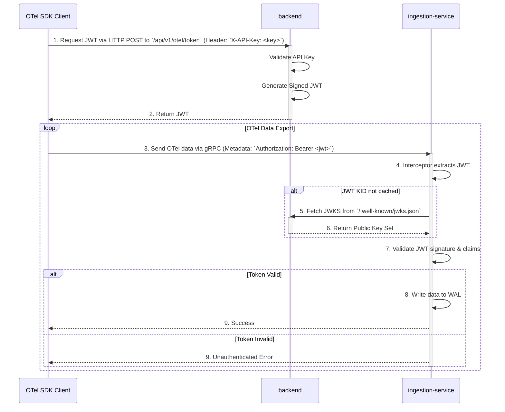

# Junjo Server: System Architecture for LLM Agents

This document provides a high-level overview of the Junjo Server architecture, designed to help LLM agents quickly understand the system's components and interaction flows.

## 1. System Overview

The Junjo Server is a multi-service system designed for ingesting, storing, and analyzing OpenTelemetry (OTel) data. It consists of two primary backend services and a client-side OTel SDK integration.

*   **`backend`**: The main application server. It handles user authentication, provides the API and web UI, and processes telemetry data for analysis.
*   **`ingestion-service`**: A dedicated, high-throughput service responsible for receiving OTel data from clients and persisting it to a Write-Ahead Log (WAL).
*   **Client (OTel SDK)**: Any application configured with the OTel SDK to send telemetry data to the Junjo platform.

## 2. Component Architecture

The services are designed to be decoupled, with specific responsibilities to ensure scalability and resilience.

```mermaid
graph TD
    subgraph Client
        A[OTel SDK] -->|gRPC:50051 (Public, JWT Auth)| B
    end

    subgraph "ingestion-service"
        B(gRPC Server) -->|Writes| C{BadgerDB WAL}
    end

    subgraph "backend"
        E(Backend API Server)
        F{DuckDB}
        G[API Clients / UI]
        H(JWKS Endpoint)
        I(Token Exchange Endpoint)

        E -->|Indexes| F
        E -->|HTTP:1323| G
    end

    A -->|HTTP (for Token)| I
    B -->|HTTP (for JWKS)| H


    style B fill:#d4edda,stroke:#155724
    style E fill:#cce5ff,stroke:#004085
```

### `backend` Service

*   **Responsibilities**:
    *   Serves the main web UI and REST API on port `1323`.
    *   Manages user accounts and API keys.
    *   Acts as the **Identity Provider** for the system. It issues JSON Web Tokens (JWTs) to clients.
    *   Publishes a JSON Web Key Set (JWKS) at `/.well-known/jwks.json` for JWT signature verification.
    *   (Future) Reads data from the `ingestion-service` to index it into a queryable database (DuckDB).
*   **Key Files**:
    *   [`backend/main.go`](backend/main.go): Main application entry point.
    *   [`backend/api/otel_token/`](backend/api/otel_token/): Logic for the JWT exchange endpoint.
    *   [`backend/jwks/jwks.go`](backend/jwks/jwks.go): Logic for the JWKS endpoint.

### `ingestion-service`

*   **Responsibilities**:
    *   Exposes a public gRPC server on port `50051` to receive OTel trace, metric, and log data.
    *   **Enforces Authentication**: Protects its gRPC endpoint using a JWT interceptor. It validates tokens against the `backend`'s JWKS endpoint.
    *   Persists all incoming data to a highly-performant Write-Ahead Log (WAL) using BadgerDB.
    *   It is the sole owner of the BadgerDB instance to prevent data corruption.
*   **Key Files**:
    *   [`ingestion-service/main.go`](ingestion-service/main.go): Main application entry point.
    *   [`ingestion-service/server/server.go`](ingestion-service/server/server.go): gRPC server setup.
    *   [`ingestion-service/server/jwt_interceptor.go`](ingestion-service/server/jwt_interceptor.go): The JWT authentication logic.
    *   [`ingestion-service/jwks/jwks.go`](ingestion-service/jwks/jwks.go): The client for fetching the JWKS and handling key rotation.
    *   [`ingestion-service/storage/badger.go`](ingestion-service/storage/badger.go): The BadgerDB WAL implementation.

## 3. Authentication Flow (JWT-based)

Authentication is handled via a token exchange mechanism. Clients exchange a long-lived API key for a short-lived JWT, which is then used to authenticate requests to the `ingestion-service`.



### Step-by-Step Process:

1.  **Token Exchange**: The client sends an HTTP POST request to the `backend`'s `/api/v1/otel/token` endpoint, providing their API key in the `X-API-Key` header.
2.  **JWT Issuance**: The `backend` validates the API key. If valid, it generates a new RSA256-signed JWT and returns it to the client. The JWT has a short expiration time (e.g., 1 hour).
3.  **Authenticated Export**: The client configures its OTel gRPC exporter to include the JWT in the metadata of every outgoing request to the `ingestion-service`. The header is `Authorization: Bearer <jwt>`.
4.  **Token Validation**: The `ingestion-service`'s `JWTInterceptor` catches every incoming request.
5.  **JWKS Fetch**: The interceptor checks the token's signature. To do this, it needs the public key. It fetches the key from the `backend`'s `/.well-known/jwks.json` endpoint, identifying the correct key via the `kid` (Key ID) in the JWT header.
6.  **Reactive Key Rotation**: The JWKS client in the `ingestion-service` is reactive. If it sees a `kid` it doesn't have a key for, it automatically refetches the JWKS from the `backend`. This allows the `backend` to rotate its signing keys without requiring a restart of the `ingestion-service`.
7.  **Access Control**: If the JWT is valid and unexpired, the request is allowed to proceed. Otherwise, it is rejected with an `Unauthenticated` error.

## 4. Data Flow: WAL and Indexing

The `ingestion-service` acts as a Write-Ahead Log (WAL) for the main `backend`. This decouples the high-throughput ingestion of OTel data from the more resource-intensive process of indexing that data for querying.

```mermaid
graph TD
    subgraph "ingestion-service"
        A(gRPC Server) -->|Writes| B{BadgerDB WAL}
        C(Internal gRPC API) -->|Reads| B
    end

    subgraph "backend"
        D(Ingestion Client) -->|gRPC (Internal)| C
        D -->|Processes & Batches| E(OTel Span Processor)
        E -->|Indexes| F{DuckDB}
    end

    style A fill:#d4edda,stroke:#155724
    style C fill:#cce5ff,stroke:#004085
    style D fill:#cce5ff,stroke:#004085
```

### Step-by-Step Process:

1.  **Write to WAL**: The `ingestion-service` receives OTel data via its public gRPC endpoint and immediately writes the raw, serialized data to a BadgerDB WAL. This is a fast, append-only operation.

2.  **Internal Read API**: The `ingestion-service` exposes a second, internal-only gRPC service (`WALReaderService`) that allows the `backend` to read data from the WAL in batches.

3.  **Client Polling**: The `backend`'s `ingestion_client` periodically polls the `WALReaderService`, requesting a batch of spans starting from the last key it successfully processed.

4.  **State Management**: The `backend` is responsible for persisting the key of the last span it indexed. This ensures that if the `backend` restarts, it can resume processing from where it left off without missing any data.

5.  **Processing and Indexing**: Once the `backend` receives a batch of spans, it uses its `otel_span_processor` to deserialize, process, and index the data into a DuckDB database, making it available for querying via the main API.

This pull-based architecture makes the system resilient. The `ingestion-service` can continue to accept data even if the `backend` is temporarily down or slow to index.