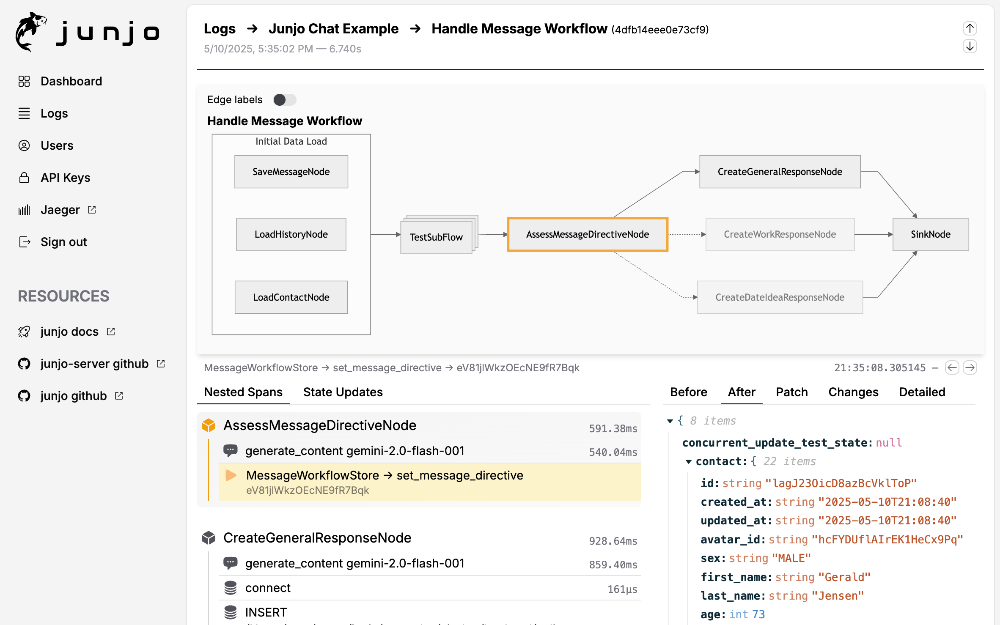

# Junjo 順序 Server

> Japanese Translation: order, sequence, procedure

Junjo Server is an opentelemetry ingestion server and AI graph workflow debugging interface designed to be run with Docker and deployed to a virtual machine.

This is a companion telemetry server for the [Junjo Python SDK](https://github.com/mdrideout/junjo).



_junjo-screenshot.png_

### Components

This repository contains everything that runs the Junjo telemetry server and user interface.

- Go Echo API and gRPC server [docs](/backend/README.md)
- Jaeger server - Junjo comes with a Jaeger server to demonstrate full opentelemetry span compatibility
- React frontend (Vite React SPA)
- Authentication via Caddy reverse proxy forward with and session cookies

## Running The Dev Environment

Docker is required for local development so your developer experience mirrors how things work in production.

- **hot reloading** is still supported in both the *frontend* and *backend*. 

### Caddy Server
Caddy is utilized as a reverse proxy to facilitate authentication guarded access to various services.
- This runs in local development mode as part of the development environment build
- It is expected that your virutal machine will have it's own Caddy service running, therefore it is excluded from production builds.

#### .env requirements

See the `.env.example` files in these subdirectories for required environment variables.

- `/backend` .env
- `/frontend` .env

#### Docker Commands

Docker compose can be used to launch the frontend and backend together, with hot reloading for local development.

> Ensure the project root `.env` file contains `BUILD_TARGET=development`

> TIP: `docker compose down -v` is required if node modules or go modules change (installed / uninstalled)

```bash
# Create the network (if it does not already exist)
$ docker network create caddy-proxy-network

# Start the frontend and backend
$ docker compose up --build

# Close and clear volumes
$ docker compose down -v
```

#### Accessing Services

- Frontend: https://localhost:5151
- Backend API: https://localhost:1323/
- Jaeger UI: https://localhost/jaeger 
  - This is routed through Caddy reverse proxy forward_auth for authentication via the Backend API's cookie header validation