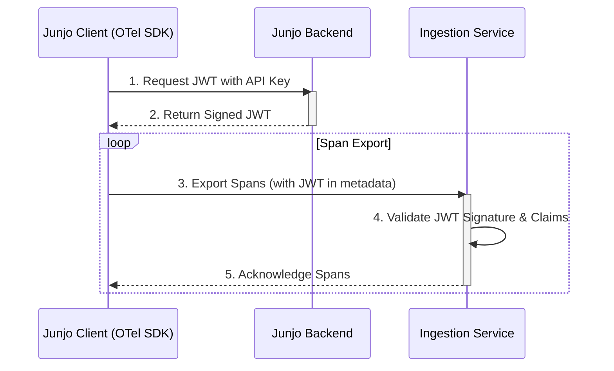

# Ingestion Service Architectural Plan

## 1. Finalized Architecture

The goal is to create a standalone `ingestion-service` that acts as the sole owner of a BadgerDB-based Write-Ahead Log (WAL). This service will handle all OTel ingestion and provide an internal API for the main backend to read spans for indexing.

**Architecture Diagram:**

```mermaid
graph TD
    subgraph Client
        A[OTel SDK] -->|gRPC:50051 (Public)| B
    end

    subgraph Ingestion Service (New Container)
        B(Public OTel Server) -->|Writes| C{BadgerDB WAL}
        D(Internal Read API - Future) -->|Reads| C
    end

    subgraph Main Backend (Existing Container)
        E(junjo-server-backend) -->|gRPC (Internal - Future)| D
        E -->|Indexes| F{DuckDB}
        E -->|HTTP:1323| G[API Clients]
    end

    style B fill:#d4edda,stroke:#155724
    style D fill:#cce5ff,stroke:#004085
```

## 2. Implementation Plan

The project will be executed in the following phases. The scope of this project is limited to building the ingestion writer. The internal read API is a future enhancement.

- [x] **Phase 1: Project Scaffolding & Configuration**
- [x] **Phase 2: Implement Ingestion Logic with BadgerDB**
- [x] **Phase 3: Transplant and Refactor gRPC Server**
- [x] **Phase 4: Decouple from Main Backend**
- [x] **Phase 5: Documentation & Final Review**

## 3. Detailed Phase Breakdown

### Phase 1: Project Scaffolding & Configuration (Completed)

-   **New Directory**: A new top-level directory named `ingestion-service` will be created.
-   **Go Module**: A new Go module will be initialized (`go mod init junjo-server/ingestion-service`).
-   **Dockerfile**: A multi-stage `Dockerfile` will be created for a lightweight production image.
-   **`docker-compose.yml`**: A new `ingestion-service` definition will be added, exposing port `50051` and mounting a volume for BadgerDB at `./.dbdata/badgerdb`.
-   **Environment Variables**: New variables for the service will be added to the `.env` file.

### Phase 2: Implement Ingestion Logic with BadgerDB (In Progress)

1.  **Add Dependency**: Add BadgerDB to the new service's `go.mod` file.
2.  **Storage Wrapper**: Create a `storage` package to abstract all BadgerDB interactions. This package will provide:
    -   `NewStorage(path string)`: A function to open the database and return a storage client.
    -   `storage.WriteSpan(span *tracepb.Span)`: A method to serialize the protobuf span and write it to BadgerDB. The key will be a nanosecond timestamp to ensure chronological ordering.
    -   `storage.Close()`: A method to safely close the database connection.
3.  **Serialization**: Spans will be stored as raw `[]byte` after being marshaled from their protobuf representation. This is the most efficient format.

### Phase 3: Transplant and Refactor gRPC Server

1.  **Move Code**: The gRPC server and OTel service implementations (`server.go`, `otel_trace_service.go`, etc.) will be moved from `backend/telemetry` to the `ingestion-service`.
2.  **Refactor Trace Service**: The `Export` method in `otel_trace_service.go` will be rewritten. The call to `ProcessSpan` will be replaced with a call to our new `storage.WriteSpan` method. All complex logic for parsing spans will be removed.
3.  **Simplify Server**: The new `server.go` will be streamlined to:
    -   Initialize the BadgerDB connection via the `storage` package.
    -   Start the gRPC server with the OTel services.
    -   It will *not* have any connection to DuckDB.
4.  **JWT-Based Authentication**: The old API key validation has been replaced with a JWT-based interceptor. The `ingestion-service` now validates JWTs issued by the main backend, ensuring secure and modern authentication for all incoming OTel data. The API key is used to issue the JWT.

### Phase 4: Decouple from Main Backend

1.  **Remove gRPC from Backend**: The gRPC server initialization and the goroutine that starts it will be completely removed from `backend/main.go`.
2.  **Update Docker Compose**: The `50051` port mapping will be removed from the `junjo-server-backend` service definition.
3.  **Cleanup**: The `backend/telemetry` directory will be cleaned up. Files related to running the gRPC server will be deleted. The `otel_span_processor.go` will be kept, as its logic will be repurposed for the future indexing process.

### Phase 5: Documentation & Final Review

1.  **Update `README.md`**: The main `README.md` will be updated to include a section on the new `ingestion-service`, explaining its role in the architecture.
2.  **Document Configuration**: All new environment variables required by the `ingestion-service` will be documented.
3.  **Final Review**: A final check will ensure the two services are correctly configured, decoupled, and the new architecture is clearly documented and ready for future development.

## 4. Data Flow: From Ingestion to Indexing

This section details how the `ingestion-service` manages the BadgerDB WAL and how the main `backend` service consumes data for indexing into DuckDB and Qdrant.

### The "Database Server" Pattern

The `ingestion-service` is the **sole owner** of the BadgerDB instance. It is the only process that directly reads from or writes to the database files. This is critical for preventing data corruption, as BadgerDB allows only one process to have the database open at a time.

To achieve this while allowing the `backend` to access the data, the `ingestion-service` functions as a dedicated database server, handling two tasks concurrently using goroutines:

1.  **Writing (Public API)**: A goroutine runs the public-facing gRPC server on port `50051`. It listens for incoming OTel spans, immediately serializes them to their raw protobuf format, and writes them to BadgerDB. This operation is optimized for high-throughput, low-latency writes.

2.  **Reading (Internal API - Future)**: A second goroutine will run another, internal-only gRPC server on a different port (e.g., `50052`). This server exposes an API for the `backend` to securely read batches of spans from the WAL.

### The Indexing Process

The main `backend` service is a **client** of the `ingestion-service`'s internal read API. The process for indexing is as follows:

1.  **Requesting Data**: The `backend` service will periodically poll the `ingestion-service`'s internal gRPC endpoint. It will make a request like `GetSpans(start_timestamp, batch_size)`, asking for a batch of spans that have been received since the last one it processed.

2.  **State Management**: The `backend` is responsible for persisting the timestamp (or key) of the last span it successfully indexed. This state must be stored durably (e.g., in its own SQLite database) so that if the `backend` restarts, it can resume processing from exactly where it left off, ensuring no data is missed or re-indexed.

3.  **Receiving and Processing**: The `ingestion-service` reads the raw span data from BadgerDB and streams the requested batch back to the `backend`.

4.  **Indexing**: Once the `backend` receives the batch of raw protobuf spans, it deserializes them and uses the existing `ProcessSpan` logic to parse the data and insert it into the appropriate tables in **DuckDB** and vector collections in **Qdrant**.

This pull-based mechanism effectively decouples the high-throughput ingestion from the more resource-intensive and potentially slower indexing process, creating a resilient and scalable system.

# Authentication

Authentication has been upgraded from a static API key to a dynamic JWT-based flow. This enhances security by using short-lived, signed tokens instead of long-lived static keys. The backend acts as the identity provider, issuing JWTs to clients in exchange for a valid API key.

**Architecture Diagram:**



### Detailed Authentication Flow

1.  **Token Exchange**:
    *   On initialization, the Junjo client library will use the `JUNJO_SERVER_API_KEY` to make a REST API call to a new endpoint on the backend, e.g., `/api/v1/auth/token`.
    *   The backend validates the API key. If it's valid, it generates a signed JWT with a reasonable expiration time (e.g., 1 hour).
    *   The backend returns the JWT to the client.

2.  **Span Export with JWT**:
    *   The client library configures its OTel gRPC exporter to add the JWT to the metadata of every outgoing request to the ingestion service.
    *   The standard practice is to use the `Authorization` header with the `Bearer` scheme: `Authorization: Bearer <jwt>`.

3.  **Token Validation**:
    *   The ingestion service will have a gRPC interceptor that inspects the metadata of incoming requests for the JWT.
    *   It will validate the JWT's signature using a public key shared with the backend.
    *   It will also check the token's claims, such as `exp` (expiration) and `iss` (issuer), to ensure it's valid.
    *   If the token is invalid, the request is rejected with an `Unauthenticated` error.

4.  **Token Refresh**:
    *   The client library will be responsible for managing the JWT's lifecycle.
    *   Before the token expires, the library will automatically perform the token exchange again to get a new JWT. This process should be seamless and not interrupt the exporting of spans.

### Component Responsibilities

*   **Junjo Client Library (`init_otel`)**:
    *   Implement a "Token Provider" that handles the JWT exchange and refresh logic.
    *   Modify the `JunjoServerOtelExporter` to use a gRPC interceptor that injects the token into the request headers.
    *   Handle errors gracefully, e.g., if the backend is unavailable for a token refresh, it should retry with an exponential backoff strategy.

*   **Junjo Backend**:
    *   **Done:** A new endpoint `/api/v1/otel/token` has been created to exchange a valid API key for a JWT.
    *   **Done:** Logic to validate API keys and issue signed JWTs has been implemented.
    *   **Done:** The private key for signing is managed securely.
    *   **Done:** A JWKS (JSON Web Key Set) endpoint at `/.well-known/jwks.json` has been implemented to publish the public key for JWT validation. This allows for dynamic key rotation.

*   **Ingestion Service**:
    *   **Done:** A unary gRPC interceptor (`JWTInterceptor`) has been added to the server.
    *   **Done:** The interceptor successfully extracts and validates JWTs from the `Authorization` header in the request metadata.
    *   **Done:** The service fetches the public key from the backend's JWKS endpoint to verify token signatures. It also implements a reactive refetching mechanism to handle key rotation seamlessly.
    *   **Done:** The old API key interceptor has been removed.

### Reliability & Security Considerations

*   **Token Expiration**: Short-lived tokens enhance security. The client's ability to refresh them automatically ensures reliability.
*   **Key Management**: Using a JWKS endpoint for public key distribution is the most secure and flexible approach. It allows for automated key rotation.
*   **Backend Unavailability**: If the backend is down, clients with valid, unexpired JWTs can continue to send data to the ingestion service. New clients or those with expired tokens will be blocked until the backend recovers. The client library's retry logic is crucial here.

# Future: Badger Size Management
Implement a mechanism to request deletion of indexed data, or deletion of data older than a certain timestamp.
