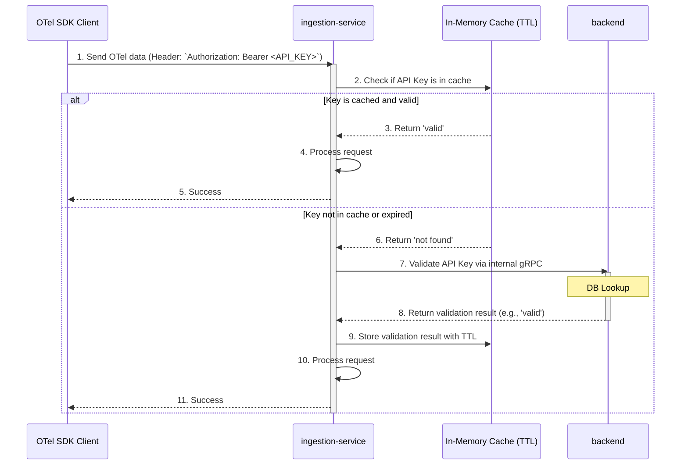

# Migration Plan: From JWT to Static API Key with Caching

## 1. Overview and Rationale

This document outlines the plan to migrate the Junjo Server's authentication mechanism for its OpenTelemetry (OTel) ingestion endpoint from a JWT-based flow to a static API key model.

**Decision Rationale:**

The current JWT-based authentication, while secure, introduces significant complexity on the client-side (`Junjo Otel Exporter`). Key issues include:

1.  **Blocking Initialization**: The synchronous token exchange during the exporter's `__init__` method can block application startup.
2.  **Token Refresh Complexity**: The OTel SDK does not provide a straightforward way to update headers for exporters, making JWT refresh for long-running applications difficult.
3.  **Deviation from Industry Practice**: Most commercial and open-source OTel exporters utilize a simpler static API key model. This is a well-understood and trusted pattern in the observability community.

By switching to a static API key model, we can **drastically simplify the client implementation**, making the Junjo OTel Exporter more robust, easier to maintain, and more aligned with developer expectations. The server-side will handle the validation, supplemented by a cache in the `ingestion-service` to ensure high performance and resilience.

## 2. Proposed Architecture

The new authentication flow will involve the client sending its static API key directly to the `ingestion-service`. The `ingestion-service` will be responsible for validating this key against the `backend` service, using a cache to minimize latency.



## 3. Implementation Plan

This migration will be executed in three phases to ensure a smooth transition.

### Phase 1: Backend Service Changes

**Goal**: Create a new internal gRPC endpoint in the `backend` for validating API keys.

1.  **Update Protobuf Definition**: Modify `backend/proto/auth.proto` to add a new RPC to the `InternalAuthService`.

    ```proto
    service InternalAuthService {
      // Deprecated: will be removed after migration.
      rpc ExchangeApiKeyForJwt(ExchangeApiKeyForJwtRequest) returns (ExchangeApiKeyForJwtResponse);

      // ValidateApiKey checks if an API key is valid.
      rpc ValidateApiKey(ValidateApiKeyRequest) returns (ValidateApiKeyResponse);
    }

    message ValidateApiKeyRequest {
      string api_key = 1;
    }

    message ValidateApiKeyResponse {
      bool is_valid = 1;
      string project_id = 2; // Or other relevant metadata
    }
    ```

2.  **Generate Protobuf Code**: Run `make proto` in the `backend` directory to generate the new Go code.

3.  **Implement gRPC Service**: Create a new method in the `backend`'s internal auth service to handle the `ValidateApiKey` RPC. This method will use the existing API key repository to look up the key in the database and return whether it's valid.

### Phase 2: Ingestion-Service Changes

**Goal**: Replace the JWT interceptor with a new interceptor that validates static API keys using the new `backend` endpoint and a local cache.

1.  **Update Protobuf Definition**: Sync `ingestion-service/proto/auth.proto` with the changes from the `backend`.

2.  **Generate Protobuf Code**: Run `make proto` in the `ingestion-service` directory.

3.  **Implement Backend Client**: Create a new client function in `ingestion-service/backend_client/` to call the `ValidateApiKey` RPC on the `backend` service.

4.  **Create API Key Interceptor**: Implement a new gRPC `UnaryServerInterceptor` (`ApiKeyAuthInterceptor`).
    *   **Extraction**: It will extract the token from the `Authorization: Bearer <token>` header.
    *   **Caching**: It will use an in-memory, thread-safe cache (e.g., `github.com/patrickmn/go-cache`) to store validation results. The cache keys should have a TTL of 1 hour to periodically remove stale keys and force re-validation.
    *   **Validation Logic**:
        *   If a key is found in the cache and is valid, the request proceeds.
        *   If a key is not in the cache, the interceptor calls the `backend`'s `ValidateApiKey` service.
        *   The result is stored in the cache.
        *   If validation is successful, the request proceeds. Otherwise, it's rejected with an `Unauthenticated` error.
    *   **Resilience**: The gRPC client call to the `backend` must be resilient to temporary failures. Implement a retry policy with exponential backoff (e.g., using a library like `grpc-ecosystem/go-grpc-middleware/retry`). If the `backend` is unavailable after several retries, the request should be rejected.

5.  **Update Server**: In `ingestion-service/main.go`, replace the `JWTInterceptor` with the new `ApiKeyAuthInterceptor`.

### Phase 3: Client Library (Junjo SDK) Changes

**Goal**: Simplify the `JunjoServerOtelExporter` to use a static API key.

1.  **Remove JWT Logic**: Delete the `_authenticate` method and the gRPC client for the `AuthService`.
2.  **Update Constructor**: The `__init__` method should no longer perform any blocking calls. It will simply store the API key.
3.  **Update Exporter Configuration**: The OTLP exporters (`OTLPSpanExporter`, `OTLPMetricExporter`) should be configured with static headers containing the API key.
    ```python
    headers = {
        "authorization": f"Bearer {self.api_key}"
    }
    # ... configure exporters with these headers
    ```

## 4. Deprecation and Removal of JWT Flow

To ensure a seamless transition, we can support both authentication methods for a limited time.

1.  **Dual-Auth Interceptor**: The `ApiKeyAuthInterceptor` can be designed to first check if the token is a valid JWT. If it is, it can use the existing JWKS logic. If it's not a JWT, it can proceed with the new API key validation flow. This provides backward compatibility.
2.  **Client Rollout**: Once the new, simplified client SDK is released, users can upgrade at their own pace.
3.  **Final Removal**: After a suitable deprecation period, the JWT validation logic, the `AuthService` on the `ingestion-service`, and the `ExchangeApiKeyForJwt` RPC on the `backend` can be safely removed.

This phased approach ensures that the system remains secure and performant while significantly improving the developer experience for users of the Junjo platform.